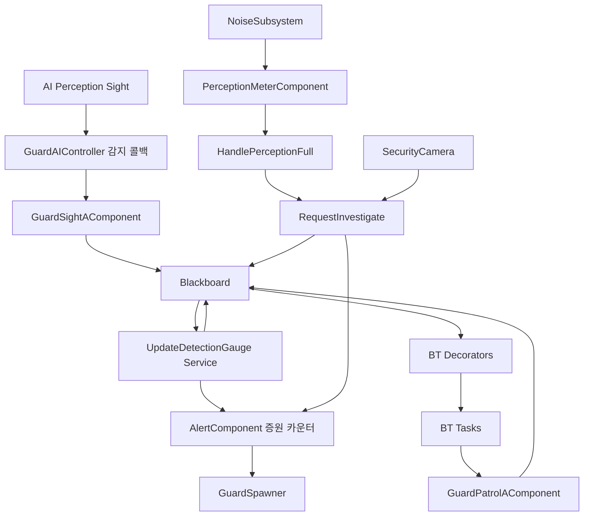

# HeavyHanded AI / Behavior Tree / Blackboard 분석

분석 기준: 2026-10-01 현재 작업 트리와 사용자가 추가 제공한 BT 스크린샷. 프로젝트 C++ 및 로컬 UE 5.4 엔진 소스를 대조했으며 소스 수정 없이 정적 분석했다.

이 문서는 후속 AI 작업에서 구조와 호출 흐름을 복원하기 위한 기록이다. 코드가 바뀌면 해당 구현을 다시 확인해야 한다.

## 1. 확인 범위와 제한

- `Public/AI`의 헤더 21개, `Private/AI`의 구현 19개를 확인했다. `.gitkeep` 2개는 제외한다.
- BT 노드는 Decorator 5종, Service 3종, Task 4종이다.
- 연관된 `GuardCharacter`, `PerceptionMeterComponent`, `NoiseListener`, `NoiseSubsystem`의 소음 전달 경로, `AlertComponent`의 경계도/증원 경로, `SecurityCamera::CallNearbyGuard`도 확인했다.
- 프로젝트는 `.uproject`에서 UE 5.4를 사용한다. 빌드 의존성에 `AIModule`, `NavigationSystem`, `GameplayTags`, `GameplayAbilities`, `UMG`, `DeveloperSettings`, `ProceduralMeshComponent`가 포함된다.
- `BT_Guards.uasset`, `BT_GuardsNewVer.uasset`, `BB_Guards.uasset`, 경비 컨트롤러 BP 및 `DT_GuardStats.uasset`의 존재는 확인했다. 바이너리 에셋 자체의 프로퍼티는 읽지 않았다.
- 추가 스크린샷에서 ROOT의 `BB_Guards`, Selector의 연결 구조, 기본 Blackboard 조건, 표시된 Observer Aborts, 서비스 부착 위치, Wait 길이와 Move To 키를 확인했다. 상세 구조와 추가 분석은 13절에 기록한다.
- 스크린샷에는 BT 에셋 이름/상세 패널이 없으므로 `BT_Guards`와 `BT_GuardsNewVer` 중 어느 에셋인지, BP별 실제 사용 여부, 커스텀 Decorator의 임계값/TimeKeyName/TimeoutSeconds/조건 반전, Move To 세부 옵션, 서비스의 몽타주/LookAroundType 등은 미확인이다. 문서의 C++ 기본값과 이미지에서 읽은 값은 구분하며 실행 검증 결과로 취급하지 않는다.

## 2. 전체 구조

| 구성 | 실제 책임 |
| --- | --- |
| `AGuardAIController` | Pawn 빙의, 컴포넌트 초기화, DT 스탯 적용, BB 생성/BT 실행, 감지 이벤트 전달, 조사 요청, 상태 기록, 속도 적용, 판 종료 대응 |
| `GuardAIKeys` | BB 키 이름 9개를 `FName` 상수로 관리 |
| `UGuardSightAComponent` | Sight 설정, 수직/양안 각도 검사, 시야 이벤트를 BB에 기록, 시야 디버그 메시 생성 |
| `UGuardHearingAComponent` | 청각 범위 제공, 엔진 Hearing 이벤트의 디버그 위치 기록, 경계도 가속 해제 타이머 |
| `UGuardPatrolAComponent` | 순찰 인덱스/방향, 최초 시작점 분산, 수색 단계/세션, BB 목적지 기록 |
| `UBTService_UpdateDetectionGauge` | 시야 게이지 증감, 마지막 목격 위치/시각 갱신, 추격 발생 보고, 조사 기준 위치/시각 갱신 |
| `UPerceptionMeterComponent` | 별도의 소음 게이지 누적/감소/복제, 임계값 도달 이벤트 |
| `AGuardCharacter` | 경비 종류/순찰 지점/감지 설정, 눈 소켓 기준 시점, 감지 UI 및 시야 디버그 결과 복제 |
| `UGuardAnimInstance` | 두리번 종류/활성 bool과 체포 bool 보관 |
| `AGuardSpawner` | 서버 경비 스폰, 순찰 데이터 선주입, 순찰 패턴 배정, 증원 이벤트 수신 |



BT가 분기를 선택하는 데 쓰는 BB `AIState` 키는 없다. `EGuardAIState { Patrol, Search, Chase }`와 `AIState`는 컨트롤러에 존재한다. 단순 로그 전용은 아니며 시야 메시 색상/추격 대상 무시, 카메라가 부를 순찰 경비 선택에도 사용된다. 이동속도의 추격 여부는 또 별도인 `WorldAlertSet.bIsChasing`으로 관리한다.

## 3. 초기화와 생명주기

`OnPossess` 순서:

1. `Super::OnPossess` 후 `AGuardCharacter` 캐싱. 캐스팅 실패 시 종료한다.
2. 현재 `AlertComponent`가 있으면 `OnAlertGaugeChanged` 구독.
3. Sight/Hearing 컴포넌트 `Initialize`.
4. `ApplyGuardStats`: `UGuardSettings::GuardStats`를 동기 로드하고 Pawn의 `GuardType`으로 `Standard`, `Dog`, `Armed` 행 선택.
5. `BehaviorTreeAsset` 유효성 검사. 없으면 BT 실행 및 이후 감지 델리게이트 연결을 건너뛴다.
6. BT의 `BlackboardAsset`으로 `UseBlackboard` 호출. BB 생성 실패는 로그만 남기며 함수가 즉시 종료되지는 않는다.
7. BB가 유효하면 `SearchStartTime`, `LastSeenTime`을 `-100000.f`로 초기화.
8. Perception의 `OnTargetPerceptionUpdated`, Pawn Meter의 `OnPerceptionFull` 구독.
9. `SelectNextAction(Patrol)`로 첫 목적지 선택.
10. `RunBehaviorTree(BehaviorTreeAsset)` 실행. 반환값은 확인하지 않는다.

`BeginPlay`에서는 현재 GameState와 `GameStateSetEvent` 양쪽으로 `AHeistGameState`를 연결한다. `Phase.Result`에서 `StopForMatchEnd`가 Brain 로직 → 이동 → Sight/Hearing → 머리 위 감지 게이지 타이머 순으로 중지한다. 테스트 레벨의 다른 GameState는 구독하지 않는다. `EndPlay`는 GameState 구독을 해제한다.

`DefaultGuardSystem.ini`는 `/Game/HeavyHanded/Characters/Guards/AI/DT_GuardStats.DT_GuardStats`를 지정한다. DT가 덮어쓰는 항목은 일반/추격 속도, 머리 게이지 주기, 순찰 도착 반경, 수색 횟수/반경, 시야 반경/상실 반경/수평/수직/양안 각도, 청각 반경, 소음 게이지 감소율이다. BT 서비스/데코레이터/태스크의 별도 파라미터를 DT에서 적용하는 코드는 없다.

## 4. Blackboard 키 계약

타입은 C++의 Get/Set 호출 기준이다. BB 에셋의 선언 타입과 기본값은 별도 확인이 필요하다.

| 키 | 사용 타입 | 기록 주체 | 읽는 곳 / 의미 |
| --- | --- | --- | --- |
| `TargetActor` | Object, Actor | Sight 성공 시 기록, Patrol 선택 시 Clear | 양안/체포 판정, 게이지 거리 계산, `IsTargeting`, UI, 디버그. 시야 상실/수색에서는 유지 |
| `CanSeeTarget` | Bool | Sight 콜백 성공/상실, 수직 검사 실패 | 게이지 증감과 목격 정보 갱신 여부 |
| `LastKnownLocation` | Vector | Sight 획득 시 Stimulus 위치, 보고 있는 동안 서비스가 대상 현재 위치 | 마지막 목격 위치; 서비스가 조사 목적지로 복사 |
| `PatrolLocation` | Vector | Patrol 컴포넌트 | 순찰 Move To를 위한 목적지 |
| `DetectionGauge` | Float, 0~100 | UpdateDetectionGauge 서비스 | 게이지 Decorator, 컨트롤러 게터, Pawn의 복제 UI 값 |
| `InvestigateLocation` | Vector | `RequestInvestigate`, 시야 게이지 100 서비스, 수색 지점 선택 | 현재 조사/수색 이동 목적지이자 다음 무작위 수색의 중심 |
| `SearchStartTime` | Float, 월드 시간 | 초기화, `RequestInvestigate`, 시야 게이지 100 서비스 | 조사 Timeout, 수색 세션 식별 |
| `LastSeenTime` | Float, 월드 시간 | 초기화, 수직 검사를 통과한 Sight 획득, 시야 서비스 | 게이지 감소 유예, 설정에 따라 추격 Timeout |
| `SoundTargetActor` | 미사용 | 상수 선언/정의만 있음 | 현재 C++에서 읽기/쓰기 없음 |

`SelfActor`, `IsInAttackRange`, `WanderLocation`, `HasLineOfFireOnTarget`는 키 헤더 주석에서 BB에 남은 미사용 키로 설명한다. 에셋에서 실제 존재/사용 여부는 검증하지 않았다.

대부분 키는 `GuardAIKeys`를 사용하지만 `MoveToInvestigate`의 기본 키와 `CheckSearchTimeout`의 기본 키는 문자열 리터럴이다. Gauge Decorator와 조사 이동 Task는 `BlackboardKey.SelectedKeyName`을 읽는다. 양안/체포 Decorator 및 체포 Task는 `TargetActor`를 직접 읽으므로 노드의 Key Selector를 바꿔도 조회 대상은 바뀌지 않는다.

## 5. 시야 → 감지 → 추격/조사

`OnTargetPerceptionUpdated`는 서버 권한과 Actor/BB 유효성을 검사한 뒤 Sight, Hearing에 같은 Stimulus를 전달한다. 각 컴포넌트가 Sense 종류를 구분한다.

Sight는 서버에서 처리하며 `Ability_Mimic_GuardDisguise` 태그 대상은 즉시 무시한다. Sight 이벤트에서 `CanSeeTarget`을 감지 성공 여부로 기록한다. 성공 시 기존 Gameplay Focus와 Hearing 디버그 위치를 지우고 수직 각도를 검사한다. 통과하면 `TargetActor`, `LastKnownLocation`, `LastSeenTime`을 기록한다. 수직 검사 실패 시 `CanSeeTarget=false`로 바꾼다. 상실 시 `SetChasing(false)`를 부르지만 `TargetActor`를 Clear하거나 `SearchStartTime`을 새로 쓰지는 않는다. `OnPlayerSpotted` 델리게이트는 선언되어 있으나 Broadcast 호출은 주석 처리되어 있다.

시야 서비스가 활성화되어 있는 동안의 계산:

- C++ `Interval=0.1f`; 이미지의 최상위 Selector 서비스는 `tick every 0.00s..0.20s`로 표시된다. UE 5.4 서비스는 Interval ± RandomDeviation으로 다음 실행 시간을 뽑으므로 고정 0.1초 간격이라고 표현하면 부정확하다.
- 보이는 경우 거리 계수는 300cm에서 2.5, 3000cm에서 0.5이며 사이를 선형 보간한다.
- 주변 시야의 상승률은 `40 * DistanceRate * 0.625`/초다. 기본값에서 가까운 곳 62.5/초, 먼 곳 12.5/초이다.
- 양안 시야는 기존 계산과 `100 / max(BinocularDetectionTimeSeconds, 0.01)` 중 큰 상승률을 사용한다. 기본 목표 시간 0.2초이면 최소 500/초다.
- 안 보이며 마지막 목격에서 4초 미만이면 게이지 유지. 유예 이후 15/초 감소한다. 결과는 0~100으로 Clamp.
- 보고 있는 동안 `LastSeenTime`과 대상 현재 위치 기반 `LastKnownLocation`을 계속 갱신한다.
- 현재 수정본은 매 서비스 틱 `SetChasing(CanSeeTarget && NewGauge >= 100)`을 적용한다. `Alert->ReportPursuitStarted()`는 100 미만에서 100으로 넘어갈 때만 호출한다.
- 보면서 게이지가 100이면 매 서비스 틱 `AIState=Chase`, `SearchStartTime=Now`, `InvestigateLocation=LastKnownLocation`을 갱신한다.

이 구조에서는 시야 상실 순간 조사 기준 시각/위치가 마지막으로 확실히 본 값에 멈춘다. 게이지가 100에 이르기 전에 잠깐 본 것만으로 시야 기반 조사 타이머를 열지는 않는다.

이미지의 추격 하위 Selector에는 `CanSeeTarget Is Set` 조건의 `Move To(TargetActor)`와 조건 없는 후순위 `Move To(LastKnownLocation)`이 모두 있다. 그러나 그 Selector보다 먼저 실행하는 바라보기 Sequence 역시 `CanSeeTarget Is Set`을 요구하므로, 이미 시야를 잃은 상태의 새 추격 진입에서는 마지막 위치 이동까지 도달하지 못할 수 있다. 상세 경로는 13절 참조.

## 6. 소음/카메라 → 조사

소음의 실질적인 BT 조사 경로:

`UNoiseSubsystem::ReportNoise` → `Propagate` → `INoiseListener::Execute_OnNoiseHeard` → Pawn의 `UPerceptionMeterComponent` → `OnPerceptionFull` → 컨트롤러 `HandlePerceptionFull` → `RequestInvestigate`.

- 소음 발생/전달과 Meter 누적은 서버에서 수행된다.
- 일반 소음의 유효 반경은 `min(Event.Radius, HearingComp.HearingRange)`이며 거리/차폐 감쇄를 적용한다. Global 프로필은 이 거리/차폐 계산 분기를 건너뛴다.
- Meter는 0~1 소음 게이지다. 기본 임계값 1, `GainPerStimulus=1`, 유예 3초, 감소율 0.2/초이며 감소율은 DT 적용 가능하다.
- 임계값에서 래치하고 `OnPerceptionFull`을 발화한다. 현재 컨트롤러는 조사 완료를 기다리지 않고 이벤트 수신 직후 Meter를 Reset한다.
- `RequestInvestigate`는 `InvestigateLocation`, `SearchStartTime`을 기록하고 `ReportNoiseDetected`로 증원 카운터를 보고한다. BB가 없는 경우도 Alert 보고는 실행될 수 있다.
- `RequestInvestigate` 자체는 `AIState=Search`를 설정하거나 이동을 명령하지 않는다. 이후 BT Task가 Search 상태와 이동을 적용해야 한다.
- 카메라는 범위 안에서 가장 가까운 `AIState=Patrol` 경비를 골라 같은 API를 호출한다. 카메라 요청도 현재 구현에서는 `ReportNoiseDetected` 카운터에 포함된다.

같은 소음은 엔진 `UAISense_Hearing::ReportNoiseEvent`에도 전달된다. 그러나 현재 Hearing 컴포넌트 콜백은 성공 자극의 디버그 위치만 저장한다. `SoundTargetActor`, `InvestigateLocation`, `SearchStartTime`을 기록하는 코드는 없다. Focus 지정도 주석 처리되어 있다.

## 7. BT 노드 12종

| 노드 | 동작과 기본값 |
| --- | --- |
| `BTDecorator_CheckDetectionGauge` | Float Key Selector, 기본 `DetectionGauge`; 값 >= 100이면 true. `UBTDecorator_BlackboardBase` 상속 |
| `BTDecorator_CheckSearchTimeout` | 기본 `SearchStartTime`; `Now-KeyTime < 12초`이면 true. 이름과 달리 아직 시간이 남았는지 검사. 헤더의 추격 권장 설정은 `LastSeenTime/4초` |
| `BTDecorator_CheckWorldAlert` | 컨트롤러가 Alert의 0~1을 0~100으로 환산한 값 >= 67이면 true |
| `BTDecorator_CheckBinocularVision` | 고정 `TargetActor`를 Sight 컴포넌트의 양안 수평 각도 함수로 검사. 가시성/거리/차폐를 별도로 검사하지 않음 |
| `BTDecorator_CheckArrestRange` | Pawn과 고정 `TargetActor`의 3D 거리 <= 150cm. 가시성/차폐/대상 상태를 별도로 검사하지 않음 |
| `BTService_UpdateDetectionGauge` | 위 시야 게이지와 목격 정보 업데이트. 이미지에서는 최상위 Selector에 붙어 순찰/대기/추격/수색 동안 모두 활성 범위를 공유 |
| `BTService_SetLookAround` | 활성화 시 AnimInstance에 설정한 `LookAroundType`, 비활성/Abort 시 None. 기본 Type=None |
| `BTService_PlayAggravationMontage` | 활성화 시 지정 몽타주 시작, 비활성 시 재생 중이면 0.15초 BlendOut으로 중지. AnimInstance는 `UGuardAnimInstance`여야 함 |
| `BTTask_SelectNextPatrolPoint` | `SelectNextAction(Patrol)` 호출 후 무조건 Succeeded. 호출 결과는 검사하지 않음 |
| `BTTask_SelectSearchPoint` | `SelectNextAction(Search)`가 true면 Succeeded, false면 Failed |
| `BTTask_MoveToInvestigate` | 기본 `InvestigateLocation`, AcceptanceRadius=60cm. Move 요청 성공은 InProgress, AlreadyAtGoal은 Succeeded, 요청 실패는 Failed. 실행 중 이동 상태가 Idle이면 Succeeded. Abort 시 StopMovement |
| `BTTask_AttemptArrest` | 개별 노드 인스턴스 사용. 시작 시 150cm 거리 검사/이동 중지/체포 애니메이션 활성, 3초 타이머 후 현재 BB 대상과 거리 재검사. 완료/Abort 시 애니메이션 해제, Abort 시 타이머 제거 |

이미지에서 수색 구성은 `Sequence[CanSeeTarget Is Not Set (Both Abort), Check Search Timeout (Self Abort)] → Select Search Point → Move To Investigate → Wait(2.0초, Set Look Around 서비스)`로 확인된다. Timeout의 실제 시간 키/초 값과 LookAroundType은 이미지에 표시되지 않는다.

## 8. 순찰과 수색

`SelectNextAction`은 먼저 `SetAIState(State)`를 호출한다. Patrol이면 TargetActor를 지우고 `SelectNextPatrolPoint2`를 호출한 뒤 true. Search이면 `SelectNextSearchPoint2` 결과를 반환한다. Chase에 대한 switch 실행 분기는 현재 주석 처리되어 있다.

순찰:

- 이전 목표까지의 2D 거리가 `PatrolArrivalRadius` 기본 120cm 밖이면 같은 목표 유지. 브랜치 Abort 후 재진입 시 지점을 건너뛰지 않도록 한다.
- 최초 선택은 기본 1500cm 안의 다른 경비를 자기 포함 목록으로 모아 UniqueID 순 정렬, 순번에 따라 시작 인덱스를 분산한다. 같은 PatrolPoints 경로를 사용하는 경비만 모으는 필터는 없다.
- 이후 Loop, PingPong, Random 패턴으로 진행한다. Random은 직전 지점을 제외한다.
- 실제 위치는 Pawn의 `PatrolPoints` 액터에서 얻는다. 잘못된 지점/빈 목록이면 BB를 새로 채우지 못하고 돌아갈 수 있다.

수색:

- `SearchStartTime`이 이전 처리 값과 다르면 새 세션으로 보고 `CurrentSearchStep=-1` 초기화.
- 호출마다 Step 증가. 0은 현재 `InvestigateLocation` 그대로 확인.
- 1~`SearchSweepCount`는 현재 InvestigateLocation 주변 `SearchSweepRadius` 안에서 NavMesh의 reachable 무작위 지점 선택. 기본 3회/600cm.
- 횟수 초과/유효 위치 없음/NavMesh 선택 실패 시 false → BT Task Failed.
- 이동 Task는 SearchStartTime을 갱신하지 않는다. 조사 시간이 계속 연장되는 것을 막으려는 의도다.
- 조사 시간은 목표에 도착한 순간이 아니라 마지막 감지/요청 시각 기준이며, 시야가 끊긴 후 추격 유예 구간도 같은 시간에 포함될 수 있다.

## 9. 이동속도, 증원, 표현과 네트워크

- 기본 속도 공식은 `(bIsChasing ? ChaseMoveSpeed : NormalMoveSpeed) * (bWorldAlertSpeedUp ? 1.3 : 1)`.
- DT 행 기본은 일반 150/추격 300cm/s. 다만 컨트롤러 속도 저장 구조체 자체의 기본값은 둘 다 0이므로 DT 적용 실패 상황은 별도 주의가 필요하다.
- 월드 경계도 34 이상 진입 시 가속하고 `bWorldAlertSpeedTriggered`로 같은 구간의 재발동을 막는다. 34 미만에서 이 래치를 해제한다.
- 경계도 변경 콜백은 가속 중이면 무소음 타이머 20초를 다시 시작한다. 현재 코드에는 증가 방향만 검사하는 조건이 없어, 감소 알림도 타이머를 연장할 수 있다. `PreviousWorldAlertLevel`은 저장하지만 비교에 사용하지 않는다.
- 무소음 타이머 만료는 `ResetMoveSpeed()`를 부른다. 이 함수는 추격 여부를 고려하지 않고 일반 속도를 직접 적용한다.
- 추격 발생 보고와 조사 발생 보고는 Alert의 별도 증원 카운터를 쓴다. 설정된 횟수에서 `OnReinforcementTriggered`가 발화하고 각 구독 스포너가 경비 1명을 추가한다.
- 스포너는 Deferred Spawn 단계에서 순찰 지점/패턴을 먼저 넣고 FinishSpawning 이후 필요하면 SpawnDefaultController를 호출한다.
- 경비 Pawn은 `bReplicates=true`. BB/컨트롤러 AIState 자체의 복제 코드는 없다.
- 시야 게이지 UI는 서버가 유효 TargetActor가 있을 때 BB 게이지를 Pawn의 `ReplicatedDetectionGaugePercent`로 복사한다. 클라이언트/호스트의 Pawn 타이머가 이 복제 값을 위젯에 전달한다.
- 소음 UI는 Meter의 0~1 값을 uint8 0~255로 양자화해 복제하며 RepNotify/델리게이트로 갱신한다.
- 시야 디버그 반경/각도/표시 여부/회전은 Pawn RepNotify로, 메시 정점/삼각형은 Unreliable Multicast로 전달한다. 기본 메시 갱신 주기는 0.25초다.
- 시야 메시의 기본 색은 Patrol 흰색, Search 노랑, Chase 주황. 디버그 형상은 바닥 Trace와 낮은 장애물 건너뛰기/추격 대상 무시를 사용하므로 실제 AI Sight 판정의 동일한 결과라고 단정할 수 없다.
- 두리번/체포 bool과 Aggravation Montage는 현재 C++에서 서버 AnimInstance를 직접 변경한다. 이 표현 상태를 원격 클라이언트에 전달하는 복제/RPC 경로는 읽은 코드에 없다. 실제 AnimBP의 다른 표현 경로는 미확인이다.

## 10. 확인된 불일치와 후속 확인 대상

아래 항목은 이번 요청에서 수정하지 않았다. 코드상 사실과 실행 시 확인할 영향으로 구분한다.

| 항목 | 근거와 영향 |
| --- | --- |
| 양안 시야각 이중 절반 | `GuardSightAComponent.cpp:261`에서 입력에 0.5를 곱해 저장하고 `:317`에서 다시 0.5를 곱한다. DT 전체 60도 입력은 실제 판정 좌우 15도, 전체 30도가 된다. DebugLine도 같은 이중 절반 사용 |
| 양안 방향의 기준 위치 | `GuardSightAComponent.cpp:289`의 ToTarget 시작 위치는 컴포넌트 Owner인 AIController의 ActorLocation이다. 시선 방향은 GuardCharacter 소켓에서 가져온다. Pawn/눈 위치 기준과 일치하는지는 런타임 확인 필요 |
| 4인 대상 관리 | Sight는 어떤 Actor의 이벤트든 공용 CanSeeTarget을 덮고 성공 Actor를 TargetActor에 기록한다. 상실 Actor가 현재 Target인지 검사하지 않으므로 한 명의 상실 이벤트가 다른 보이는 대상의 추격을 끊을 수 있다 |
| 100 게이지 유지 중 재발견 속도 | Sight 상실은 SetChasing(false). 재발견해도 게이지가 유예로 이미 100이면 서비스의 bJustCrossedFull이 false라 SetChasing(true)가 다시 실행되지 않는다. AIState는 Chase지만 속도용 bool은 false로 남을 수 있다 |
| 수색 중심 이동 | 수색은 매번 InvestigateLocation을 중심으로 읽은 뒤 새 목적지로 같은 키를 덮는다. 원래 목격 지점 중심 고정 수색이 아니라 직전 수색 지점 중심의 이동이 누적된다 |
| 시간/경계도 조건 재평가 | CheckSearchTimeout과 CheckWorldAlert에는 자체 Tick/타이머/이벤트 기반 실행 재요청 구현이 없다. 이미지의 수색 Timeout에는 Self Abort가 있지만, 그것만으로 시간 경과 감시가 추가되지는 않는다. CheckArrestRange/CheckBinocularVision은 선택 BB 키를 관찰하는 부모를 상속하나 거리/회전 자체를 감시하지 않고 Key Selector 초기화도 없다. 이미지의 체포 Range Self Abort도 연속 거리 감시를 보장하지 않는다. CheckWorldAlert는 이미지의 연결된 트리에서 보이지 않음 |
| 체포 실제 결과 미구현 | AttemptArrest 성공 경로는 로그/화면 메시지/FinishLatentTask(Succeeded)뿐이다. 플레이어 체포 상태, GAS, GameMode 등의 게임 결과 변경 호출이 없다 |
| 체포 대상/연속 거리 보장 | 시작 대상을 저장하지 않고 종료 시 BB TargetActor를 다시 읽는다. 거리도 시작/완료 순간만 검사한다. 이미지에서는 CanSeeTarget Self Abort와 CheckArrestRange Self Abort가 붙어 있다. 시야 bool 상실은 관찰 가능하지만 단순 거리 변화는 Range Decorator의 자체 실행 재요청 계기가 없어 중간 이탈 즉시 중단을 보장하지 않음 |
| 체포 시간 0 | 헤더는 ArrestDuration=0을 허용하지만 즉시 성공 처리 분기 없이 타이머를 건다. 0 설정의 태스크 종료 여부는 엔진 타이머 동작과 함께 확인 필요 |
| 조사 이동 결과 | 실행 중 Idle을 성공으로 취급하므로 정상 도착과 경로 이동 실패/중단을 구분하지 않는다. 또한 실행 중 BB 목적지 변경을 관찰/재요청하지 않는다 |
| Patrol 성공 결과 | SelectNextPatrolPoint Task는 SelectNextAction 결과를 무시하고 성공한다. 컴포넌트가 목적지를 기록하지 못한 경우에도 트리는 다음 노드로 갈 수 있다 |
| 청각 경로 차이 | HearingConfig를 PerceptionComp에 ConfigureSense하는 유일한 줄이 주석 처리되어 있다. 엔진 Hearing 활성화와 실제 설정 적용은 확인 필요. 사용자 정의 NoiseSubsystem → Meter 경로는 이 ConfigureSense와 별도로 존재 |
| 청각 비활성/위장 필터 | 엔진 Hearing/Sight 콜백은 위장 태그를 거르지만 사용자 정의 소음 누적 경로에는 동일 필터가 없다. Hearing SetSenseEnabled(false) 역시 Meter의 등록/누적 자체를 차단하지 않는다 |
| 판 종료 정지 범위 | StopForMatchEnd는 BT/이동/엔진 감각/머리 게이지 타이머를 끈다. Meter 리스너 등록 해제, Full 델리게이트 제거, RequestInvestigate 판 종료 검사, 경계도 타이머 정리는 이 함수에 없다. 종료 이후 소음/증원 영향은 연관 시스템과 실행 확인 필요 |
| 눈 소켓 폴백 회전 | GuardCharacter::GetSightSocketRotation은 소켓 미사용/없음으로 ActorRotation 폴백이어도 Yaw에 90도를 추가한다. 헤더의 '액터 방향 기준' 설명과 차이가 있음 |
| UI 주기 덮어쓰기 | DT에서 설정한 HeadGaugeUpdateInterval 이후 Pawn BeginPlay는 다시 0.1f를 지정한다. 라이프사이클 순서에 따라 DT 주기가 덮일 수 있음 |
| 스폰 패턴 가방 경계 | DrawNextPatrolPattern은 PatternBag[0]을 직전 패턴과 비교하지만 실제 Pop은 마지막 항목을 꺼낸다. 주석의 연속 중복 방지와 구현 위치가 일치하지 않음 |

서버 권한을 명시적으로 검사하는 주요 진입점은 감지 컨트롤러 콜백, Sight 콜백, 시야 게이지 서비스, RequestInvestigate, Meter, NoiseSubsystem, 주요 스폰 진입점이다. 반면 상태/목적지/속도를 변경하는 `SelectNextAction`, `SetAIState`, Patrol 컴포넌트 함수, 체포 Task 등의 진입부에는 직접 권한 검사가 없다. 현재 서버 컨트롤러 경로로 호출되더라도 제공된 코딩 규칙과 대조할 후속 대상이다.

여러 UPROPERTY/UFUNCTION에 Category가 없고 함수 인자가 줄바꿈된 기존 코드가 있다. 이 분석에서는 스타일 변경을 수행하지 않았다.

## 11. 주석을 그대로 믿으면 안 되는 부분

- 시야 서비스 헤더는 시야/청각 게이지를 함께 처리한다고 설명하지만 실제 로직은 CanSeeTarget 중심의 시야 게이지다.
- 서비스 마지막 주석은 상태 전환을 더 이상 하지 않는다고 설명하지만 바로 위에서 SetAIState(Chase)를 호출한다.
- 컨트롤러 감지 콜백 설명에 SoundTargetActor 갱신이 있지만 실제 C++ 사용은 없다.
- Patrol 수색 주석은 Hearing 단일 자극도 SearchStartTime/InvestigateLocation을 기록한다고 설명하지만 현재 Hearing 구현에는 그 쓰기가 없다.
- 추격 Timeout 주석은 1.5초와 4초가 혼재한다. 실제 노드 값은 에셋 확인이 필요하다.
- Meter 헤더는 조사 종료 후 Reset을 설명하지만 실제 컨트롤러는 조사 시작 요청 직후 Reset한다.
- GuardTypes 주석은 GuardType을 컨트롤러에 보관한다고 설명하지만 실제 프로퍼티는 Pawn에 있다.

## 12. 다음 작업에서 유지할 기준

1. 시야 DetectionGauge 0~100, 소음 Perception01 0~1, 월드 Alert 0~1/조회 0~100을 구분한다.
2. BB 시간 키는 월드 시간이며 SearchStartTime은 수색 세션 식별자 역할도 한다.
3. TargetActor는 Sight 상실 시 보존되고 실제 Patrol 선택에서 해제된다.
4. AIState, 속도용 bIsChasing, 실제 BT 활성 브랜치는 서로 자동 동기화되지 않는다.
5. 첨부 이미지에서 확인한 BT 연결/Abort/Wait/Move To 키는 13절을 기준으로 한다. 이미지에 표시되지 않은 상세 노드 값과 실제 BP의 에셋 참조는 C++ 기본값에서 추정하지 않는다.
6. 감지/이동/체포/소음의 게임 판정은 서버에서 처리하고 UI/애니메이션 전달 경로는 별도로 확인한다.
7. 사용자의 규칙대로 기존 구조를 유지하고 요청한 범위만 수정한다. 함수/변수 PascalCase, bool b 접두사, 명확한 Category, TObjectPtr/UPROPERTY, IsValid, RPC 이름/신뢰도, 복제 등록을 지킨다.

## 13. 첨부 BT 이미지 추가 분석

입력 자료: 사용자 첨부 `codex-clipboard-14260641-5cea-4c81-bb85-7d4001dc6a9f.png` (1559×852). 이미지의 연결선과 노드 텍스트를 확대 확인했다. 회색/노란 영역의 한국어 문구는 에디터 주석이며 실제 조건/연결과 구분한다. 노란 테두리는 에디터 선택 표시로 보이며 런타임 활성 브랜치의 증거로 사용하지 않는다.

### 13.1 ROOT와 최상위 우선순위

ROOT는 `BB_Guards`를 사용한다. 직하위는 Selector이며 `Update Detection Gauge` 서비스가 붙는다. 화면에 연결된 자식의 좌우 배치와 실행 인덱스 흐름 기준 우선순위는 아래와 같다. 일반 순찰은 화면 위에 배치되어 있지만 실행 우선순위가 가장 높다는 뜻은 아니다.

| 우선순위 | 브랜치 | 부착 조건 | 실행 내용 |
| --- | --- | --- | --- |
| 1 | 주 추격 Sequence | Check Detection Gauge: Lower Priority Abort; Check Search Timeout: Abort 표시 없음 | 플레이어 바라보기/몽타주 Sequence → 체포/추격 하위 Selector |
| 2 | 하단 플레이어 바라보기 Sequence | Check Binocular Vision; CanSeeTarget Is Set. 양쪽 모두 Abort 표시 없음 | Rotate(TargetActor) → Wait 1.0초 |
| 3 | 마지막 위치 바라보기 Sequence | CanSeeTarget Is Not Set: Lower Priority Abort; Check Detection Gauge와 Check Search Timeout: Abort 표시 없음 | Rotate(LastKnownLocation) → Wait 1.5초 |
| 4 | 마지막 위치 조사/수색 Sequence | CanSeeTarget Is Not Set: Both Abort; Check Search Timeout: Self Abort | Select Search Point → Move To Investigate → Wait 2.0초(Set Look Around) |
| 5 | 일반 순찰 Sequence | 별도 Decorator 없음 | Wait 5.0초(Set Look Around) → Select Next Patrol Point → Move To(PatrolLocation) |

표의 커스텀 조건은 노드 클래스와 보이는 Abort 설정만 확정한 것이다. `Check Detection Gauge`의 실제 GaugeThreshold/선택 키, `Check Search Timeout`의 실제 TimeKeyName/TimeoutSeconds 및 커스텀 조건의 반전 여부는 상세 패널이 없어 확정하지 않는다. 여러 개의 일반 Decorator가 부착된 구조는 엔진의 기본 AND 평가를 기준으로 분석하며 커스텀 복합 논리 노드는 이미지에 보이지 않는다.

이미지에는 연결된 `Check World Alert` 노드가 없다. 따라서 이 트리의 추격 조건에 월드 경계도 67 이상이 반드시 필요하다고 해석하면 안 된다. C++의 월드 경계도 이동속도 반응은 별도 경로로 남아 있다.

### 13.2 연결 구조 복원

```text
ROOT [BB_Guards]
└─ Selector [Service: Update Detection Gauge, 표시 주기 0.00..0.20초]
   ├─ Sequence [Gauge: Lower Priority, Timeout]
   │  ├─ Sequence [CanSeeTarget Is Set]
   │  │  ├─ Rotate to face BB entry [TargetActor]
   │  │  └─ Wait 0.5초 [Service: Play Aggravation Montage, 표시 주기 1.00초]
   │  └─ Selector
   │     ├─ Sequence [CanSeeTarget Is Set: Self, Check Arrest Range: Self]
   │     │  └─ Attempt Arrest
   │     ├─ Sequence [CanSeeTarget Is Set: Both]
   │     │  └─ Move To [TargetActor]
   │     └─ Move To [LastKnownLocation]
   ├─ Sequence [Check Binocular Vision, CanSeeTarget Is Set]
   │  ├─ Rotate to face BB entry [TargetActor]
   │  └─ Wait 1.0초
   ├─ Sequence [CanSeeTarget Is Not Set: Lower Priority, Gauge, Timeout]
   │  ├─ Rotate to face BB entry [LastKnownLocation]
   │  └─ Wait 1.5초
   ├─ Sequence [CanSeeTarget Is Not Set: Both, Timeout: Self]
   │  ├─ Select Search Point
   │  ├─ Move To Investigate
   │  └─ Wait 2.0초 [Service: Set Look Around, 표시 주기 2.00초]
   └─ Sequence
      ├─ Wait 5.0초 [Service: Set Look Around, 표시 주기 5.00초]
      ├─ Select Next Patrol Point
      └─ Move To [PatrolLocation]

분리된 노드: Sequence [Check Binocular Vision]
  - 왼쪽 몽타주 영역 안에 있지만 부모/자식 연결선이 없다.
  - 연결된 Rotate → Wait(몽타주) 경로에는 이 조건이 붙어 있지 않다.
```

Wait의 0.5/1.0/1.5/2.0/5.0초는 노드에 표시된 값이다. 각 Wait의 Random Deviation 등 숨은 세부 옵션은 미확인이다. 서비스에 표시된 tick 주기는 연출 길이나 실행 반복 횟수와 같은 의미가 아니다. `SetLookAround`와 `PlayAggravationMontage`는 C++에서 OnBecomeRelevant/OnCeaseRelevant로 작동하며 자체 TickNode에 연출 반복 로직을 구현하지 않는다.

### 13.3 화면 구조와 C++를 합친 동작 해석

1. **순찰:** 기다린 뒤 지점을 선택하고 이동한다. 첫 목적지는 OnPossess가 미리 넣지만, 이미지의 순찰 Sequence는 첫 진입에도 5초 Wait가 먼저다. 이후 성공하여 트리가 반복되면 다시 Wait를 거친다. 정상적인 지점 변경은 이동 완료와 컴포넌트의 도착 반경 판정에 의해 진행된다.
2. **게이지가 차기 전의 바라보기:** 주 추격의 조건이 통과하지 못하고 대상이 양안 영역에 보이면 하단의 별도 바라보기 브랜치가 선택될 수 있다. 이 브랜치 자체에는 Gauge나 Timeout 조건이 없다. 단, 두 Decorator에 Abort 표시가 없으므로 시야 획득만으로 실행 중인 순찰을 즉시 끊는 경로라고 단정할 수 없다.
3. **주 추격:** 외부 Gauge/Timeout을 통과한 뒤, 보이는 대상을 향해 회전하고 0.5초 동안 몽타주 서비스를 활성화한다. 그 다음 하위 Selector에서 거리 안이면 체포, 그렇지 않고 보이면 Actor 이동, 앞선 경로들이 실패하면 마지막 목격 위치 이동을 시도한다.
4. **상실 후 마지막 위치 이동의 제한:** 이미 CanSeeTarget=false인 상태로 주 추격 Sequence에 새로 진입하면 첫 바라보기 Sequence가 실패한다. Sequence는 다음 하위 Selector로 진행하지 않으므로 `Move To(LastKnownLocation)`은 주로 앞선 바라보기를 완료한 이후 시야를 잃고 하위 Selector가 재탐색하는 경우의 후순위 경로다. '시야를 잃으면 언제나 마지막 위치까지 추격한다'는 설명은 이 이미지 구조에는 맞지 않는다.
5. **마지막 위치 바라보기와 수색:** 별도의 마지막 위치 바라보기 브랜치가 수색보다 우선한다. 두 브랜치의 Timeout/Gauge 설정이 겹치면 1.5초 Wait 완료 후 ROOT 재탐색에서도 바라보기 브랜치가 다시 선택될 수 있다. 바라보기 조건이 풀려야 수색 단계에 진입할 수 있으므로 '1.5초 바라본 뒤 반드시 수색'이라는 고정 연쇄가 아니다.
6. **소음 조사:** 시야 게이지가 0이어도 RequestInvestigate로 SearchStartTime과 InvestigateLocation이 채워지면 수색 브랜치의 조건이 성립할 수 있다. 그러나 새로운 조사 시각만 바뀌는 것은 현재 Timeout Decorator가 관찰하는 이벤트가 아니므로 실행 중인 순찰을 즉시 끊는지는 별도 문제다.
7. **재발견:** 수색 브랜치의 CanSeeTarget Both Abort는 false→true에서 현재 수색을 중단할 수 있다. `MoveToInvestigate::AbortTask`가 이동을 정지한 뒤 높은 우선순위의 추격/바라보기 조건을 다시 평가한다. 기존 '게이지 100 유지 중 SetChasing(true) 미복구' 문제는 이 Abort 설정으로 해결되지 않는다.
8. **연출 반복:** 주 추격이 성공하고 ROOT가 반복될 때마다 앞부분의 Rotate/Wait/몽타주도 다시 통과할 수 있다. 코드와 그래프에 '최초 발각 시 1회' 래치가 없으므로 일회성 포착 연출로 보장되지 않는다. 몽타주는 Wait 서비스 비활성화 시 중지되므로 몽타주 전체 재생 완료까지 기다리는 Task도 아니다.
9. **상태 기록:** 하단 바라보기와 마지막 위치 바라보기에는 SetAIState Task가 없다. 따라서 활성 브랜치가 바뀌어도 AIState가 기존 Patrol/Chase로 남을 수 있다. Search는 Select Search Point에서, Patrol은 5초 Wait 이후 Select Next Patrol Point에서 기록된다. 순찰 복귀 직후 Wait 구간에서는 이전 Search 상태와 대상/UI가 잠시 남을 수 있다.

### 13.4 추가로 드러난 문제와 검증 포인트

| 항목 | 이미지와 소스에서 확인한 내용 |
| --- | --- |
| 미연결 양안 조건 | 왼쪽의 Check Binocular Vision Sequence는 떨어져 있다. 해당 노드로 몽타주를 양안 시야에만 제한할 수 없음. 실제 활성 양안 조건은 하단 별도 바라보기 브랜치에 있음 |
| 소음 조사 시작 지연 | 순찰 중 CanSeeTarget=false, DetectionGauge=0이 이미 유지되는 상황에서 RequestInvestigate는 위치/시각만 바꾼다. 수색의 CanSeeTarget 관찰값은 변하지 않고 Timeout은 자체 관찰하지 않으므로 다른 재탐색 계기가 없다면 진행 중인 Wait/Move To 종료까지 조사 전환이 지연될 수 있음 |
| Timeout Self Abort만으로는 시간 감시 불가 | 수색 Timeout에 Self가 표시되더라도 커스텀 클래스에는 Tick/타이머/BB 관찰에 따른 RequestExecution이 없다. 이동 중 Timeout을 초과해도 그 순간 중단한다고 보장할 수 없음. Wait/Task 완료나 다른 관찰 이벤트 때 조건이 다시 평가될 수 있음 |
| 체포 거리 Self Abort만으로는 거리 감시 불가 | Range Decorator가 BB 관찰 기반 부모를 상속하지만 Pawn/대상의 위치 변화를 직접 관찰하지 않는다. CanSeeTarget 변화 없이 범위만 벗어나는 경우 즉시 Abort 경로가 보장되지 않음. Task는 기본 3초 후 거리 재검사 |
| 게이지 조건의 중단 범위 | 주 추격 Gauge는 Lower Priority이며 Self/Both가 아니다. 낮은 우선순위 동작을 가로채는 설정이지만 활성 추격의 게이지 하락만으로 그 브랜치를 즉시 중단하는 설정은 아님 |
| 상실 후 추격 진입 차단 | 주 추격의 첫 자식이 CanSeeTarget Is Set Sequence이므로, 외부 Gauge/Timeout이 살아 있어도 이미 시야를 잃은 새 진입에서는 LastKnownLocation Move To까지 진행 불가 |
| 마지막 위치 바라보기 반복 | 별도 바라보기 Sequence가 수색보다 우선하고 완료 래치가 없다. 동일 조건이 유지되면 매번 Rotate→Wait 1.5초를 반복하여 수색 진입을 미룰 수 있음. 실제 영향을 확정하려면 두 Timeout의 키/시간과 Gauge 설정을 비교해야 함 |
| 순찰 복귀 기록 지연 | 순찰의 상태/TargetActor 초기화는 Wait 5초 이후 지점 선택 시점에 실행된다. 직전 Search 상태가 남아 카메라 호출 대상 선택/시야 색상/UI와 실제 순찰 Wait 브랜치가 일치하지 않을 수 있음 |
| 서비스 주기 | 게이지 서비스는 0.00..0.20초로 표시된다. BinocularDetectionTimeSeconds 기본 0.2초는 목표 상승률을 뜻하며 고정 두 번의 서비스 호출로 포착됨을 보장하지 않음 |
| 연출 설정값 미표시 | Set Look Around가 붙어 있다는 사실만으로 PatrolWait/InvestigateWait 값이 지정되었다고 판단할 수 없음. 기본 None이면 활성화되어도 두리번 bool이 꺼짐. 몽타주 에셋이 유효하고 AnimInstance가 맞는지도 상세 패널/실행 확인 필요 |
| Actor 이동 옵션 | Move To(TargetActor)가 연결된 사실은 확인. Track Moving Goal/Observe Blackboard Value/AcceptanceRadius는 이미지에 표시되지 않아 이동 중 실제 추적 방식과 체포 진입 반경의 관계는 별도 확인 필요 |

### 13.5 엔진 소스로 확인한 실행 규칙

아래 확인은 로컬 설치된 `C:/Program Files/Epic Games/UE_5.4/Engine/Source` 기준이며 외부 문서의 추측을 사용하지 않았다.

- `Editor/BehaviorTreeEditor/Private/BehaviorTreeGraph.cpp`: 연결 자식을 X 위치 비교로 정렬해 트리의 자식 순서/실행 인덱스를 생성한다.
- `Runtime/AIModule/Private/BehaviorTree/Composites/BTComposite_Selector.cpp`: 최초 자식부터 평가하며 Failed이면 다음 자식, Succeeded이면 부모로 돌아간다.
- `Runtime/AIModule/Private/BehaviorTree/Composites/BTComposite_Sequence.cpp`: 자식이 Succeeded일 때만 다음 자식으로 진행하며 Failed이면 Sequence를 종료한다.
- `Runtime/AIModule/Private/AIController.cpp`: RunBehaviorTree는 StartTree에 `EBTExecutionMode::Looped`를 전달한다. 최상위 성공은 영구 종료가 아니며 다음 루프에서 우선순위를 다시 탐색한다.
- `Runtime/AIModule/Private/BehaviorTree/Decorators/BTDecorator_BlackboardBase.cpp`: 선택 BB 키를 RegisterObserver하고 키 변경 시 RequestExecution한다. 공간상의 거리/각도 변화를 자동으로 추적하는 기능은 없다.
- `Runtime/AIModule/Private/BehaviorTree/BTDecorator.cpp`: Abort Mode와 조건 반전은 별도 설정이다. Abort Mode 자체가 시간 경과 감시 함수를 추가하지 않는다.
- `Runtime/AIModule/Private/BehaviorTree/BTService.cpp`: 표시된 주기는 `max(0, Interval-RandomDeviation)..Interval+RandomDeviation`이며 해당 범위에서 무작위 다음 실행 시간을 정한다.
- `Runtime/AIModule/Private/BehaviorTree/Tasks/BTTask_MoveTo.cpp`: Actor 목표 추적과 BB 변경 감시는 별도 옵션/구현을 가진다. 이미지에서 읽은 Move To 키만으로 에셋 옵션을 단정하지 않는다.

다음 에셋 확인은 커스텀 Decorator별 TimeKeyName/TimeoutSeconds/GaugeThreshold/Inverse Condition/선택 키, Move To의 반경/추적 옵션, Wait의 편차, 서비스의 LookAroundType/몽타주, 해당 이미지 BT의 실제 BP 연결을 우선한다.

이번 분석에서 빌드/PIE/4인 Listen Server 테스트는 실행하지 않았다. 코드와 콘텐츠는 수정하지 않았으며 분석 문서를 생성한 뒤 첨부 BT 분석으로 갱신했다.

## 14. 순찰 복귀 후 게이지 재감지 수정 (2026-10-01)

앞선 표와 이미지 분석은 최초 분석 시점의 구조다. 아래 항목은 이번 코드 수정으로 변경되었다.

- 원인 경로: 순찰 선택이 TargetActor를 지워도 엔진 Sight의 감지 상태는 그대로일 수 있다. Sight 콜백은 상태 변경 때 발생하므로 이미 보이는 대상의 BB 정보가 자동 복구되지 않는다. 수직 각도 판정도 콜백에서만 처리하면 수직 시야 재진입을 놓칠 수 있다. 머리 게이지 UI는 TargetActor가 없으면 0을 표시한다.
- `UGuardSightAComponent::RefreshSightTarget`: 현재 엔진 Sight 감지 목록에 대해 위장 태그와 수직 각도를 다시 판정한다. 기존 대상이 유효하면 유지하고, 그렇지 않으면 가장 가까운 유효 대상을 선택한다. 보이는 대상의 TargetActor, LastKnownLocation, LastSeenTime을 기록한 뒤 CanSeeTarget을 갱신한다. 안 보이는 동안 마지막 TargetActor는 기존 수색 흐름을 위해 유지한다.
- `UpdateDetectionGauge` 서비스는 게이지 계산 전에 위 갱신을 호출한다. 서버에서만 실행하며 별도 타이머는 추가하지 않았다.
- `SelectNextAction(Patrol)`은 CanSeeTarget=false인 경우에만 TargetActor를 지운다. 서버 권한 검사를 추가했다.
- 추격 속도 bool은 매 서비스 틱 현재 시야와 게이지 상태로 갱신한다. 따라서 게이지가 100으로 유지되는 유예 중 재발견도 추격 속도가 복구된다. 기존 표의 '100 게이지 유지 중 재발견 속도' 문제는 수정되었다.
- BT 에셋의 서비스 부착 위치는 변경하지 않았다. Update Detection Gauge가 최상위 Selector에 붙어 순찰에서도 실행되어야 이 복구 경로가 작동한다.
- PIE 확인 항목: 발견 → 상실 → 수색 종료 → 순찰 → 재발견 시 TargetActor/CanSeeTarget/DetectionGauge 갱신, 수직 시야 밖에서 안으로 이동할 때 재감지, 게이지 100 유예 중 재발견 시 추격 속도 복구.