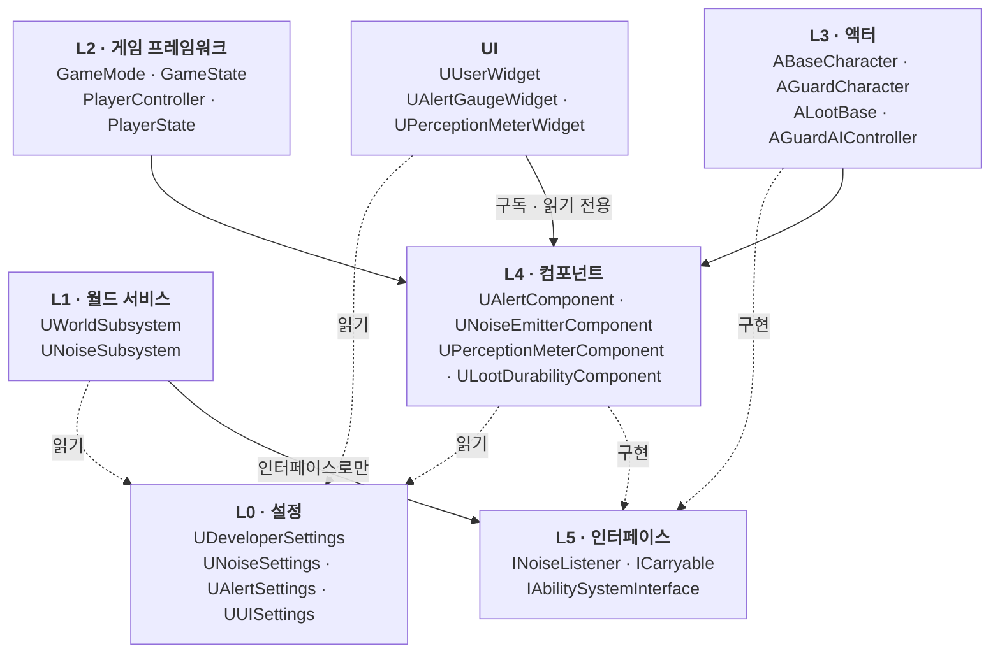
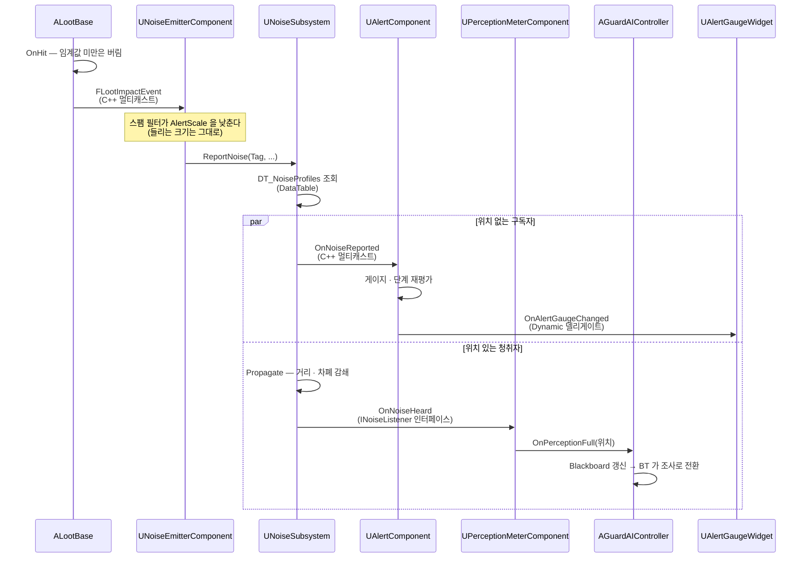
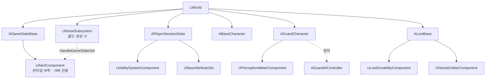

# 01. 시스템 아키텍처 및 클래스 구조

> 이 문서는 **커밋되어 확인 가능한 코드**를 기준으로 쓴다. 각 시스템의 내부 로직은 `systems/` 문서가 다룬다.

---

## 1. 이 문서의 범위

**여기서 정하는 것**

- 코드가 어떤 계층으로 나뉘고, 계층 간에 무엇을 참조해도 되는가
- 시스템 6개의 경계와 담당
- 실제 클래스 계층
- 시스템끼리 어떻게 대화하는가 (통신 수단 5종과 선택 기준)
- 무엇이 무엇을 소유하고 언제 만들어지는가
- 레벨 구성

**여기서 정하지 않는 것**

| 주제 | 문서 |
|---|---|
| 복제·RPC 규칙, 서버 권위의 구체적 적용 | [02-Networking.md](02-Networking.md) |
| C++ / BP 경계 | [03-CppVsBlueprint.md](03-CppVsBlueprint.md) |
| 태그 체계, DataTable, Settings 상세 | [04-DataManagement.md](04-DataManagement.md) |
| 폴더 구조, 네이밍 | [05-Conventions.md](05-Conventions.md) |
| 각 시스템의 내부 알고리즘 | `systems/*.md` |

---

## 2. 프로젝트 기본 정보

| 항목 | 값 | 근거 |
|---|---|---|
| 엔진 | Unreal Engine 5.4 | `HeavyHanded.uproject` |
| 런타임 모듈 | `HeavyHanded` 1개 | `HeavyHanded.Build.cs` |
| 네트워크 형태 | Listen Server | 호스트가 서버 겸 플레이어 |
| 동시 인원 | 2~4인 | 기획서 |
| 세션 | `OnlineSubsystemNull` (LAN + 직접 IP) | `HeavyHanded.uproject`. Steam 은 추후 |

모듈은 **하나뿐이다.** 시스템 경계는 모듈이 아니라 **폴더와 클래스 소유권**으로 나뉜다.
게임플레이 모듈을 쪼개는 것은 지금 규모에 이르지 않았고, 쪼갤 경우 순환 의존을 풀 비용이 이득보다 크다.

### 모듈 의존성

`HeavyHanded.Build.cs` 기준. 각 항목이 **어느 시스템 때문에 들어와 있는지**를 주석으로 남겨두었다 —
쓰지 않게 된 의존성을 나중에 안전하게 걷어내려면 이 대응이 필요하다.

| 구분 | 모듈 | 쓰는 곳 |
|---|---|---|
| Public | `Core` `CoreUObject` `Engine` `InputCore` `EnhancedInput` | 전역 / 플레이어 입력 |
| Public | `GameplayTags` `GameplayTasks` `GameplayAbilities` | 역할별 스킬, 쿨다운, 상태, GameplayCue |
| Public | `PhysicsCore` `NetCore` | 노획물 물리와 복제 |
| Public | `AIModule` `NavigationSystem` | 경비 순찰 · 조사 이동 · 시야 |
| Public | `UMG` | HUD, 게이지 위젯 |
| Public | `Niagara` | 스킬 · 파손 연출 |
| Public | `DeveloperSettings` | Project Settings 노출 |
| Private | `Slate` `SlateCore` | UMG 하위 |
| Private | `OnlineSubsystem` `OnlineSubsystemUtils` | 로비 · 세션 |
| Private | `AudioMixer` | 소음 SFX |

---

## 3. 레이어 구조

### 계층

### 참조 방향 규칙

아래 5개는 **이미 코드가 지키고 있는 것을 규칙으로 굳힌 것**이다. 새 시스템을 붙일 때도 같게 간다.

**규칙 1 — 컴포넌트는 자기 소유 액터의 구체 타입을 알지 않는다.**
`UAlertComponent` 는 `AGameStateBase` 를 전방 선언만 하고 `AShelterGameState` 를 include 하지 않는다.
어기면 컴포넌트가 특정 GameState 에 묶여 다른 맵에서 재사용되지 못한다.

**규칙 2 — 월드 서비스는 구체 액터 타입을 모른다. 인터페이스로만 접근한다.**
`UNoiseSubsystem` 은 경비도 플레이어도 모른다. `INoiseListener` 만 안다.
그래서 오유석(Hazard)이 새 감지 장치를 만들 때 소음 코드를 한 줄도 고치지 않고 붙일 수 있다.

**규칙 3 — 권위 판정은 `Shared/NetAuthority.h` 하나만 쓴다.**
이전에는 컴포넌트마다 `HasNoiseAuthority()` / `HasAlertAuthority()` 를 각자 들고 있었고,
서브시스템은 또 다른 기준(`NetMode`)을 썼다. 그 둘은 같은 뜻이 아니다 —
클라에서 로컬 스폰된 비복제 액터는 `GetOwnerRole()` 이 `ROLE_Authority` 라 컴포넌트 게이트를 그냥 통과한다.
사고가 안 났던 것은 서브시스템 게이트가 뒤에서 한 번 더 막아줬기 때문이지 의도한 안전이 아니었다.
지금은 `HasServerAuthority()` 가 두 조건을 모두 본다.

**컴포넌트와 서브시스템에서 `GetOwnerRole()` 을 직접 쓰지 말 것.**
액터는 `AActor::HasAuthority()` 를 그대로 쓴다 — `NetAuthority.h` 에 액터 오버로드가 없고,
액터에는 위의 함정(소유 액터를 거쳐 롤을 읽는 것)이 없기 때문이다.
판정 대상별 사용법은 [02-Networking.md](02-Networking.md) 3장에 있다.

**규칙 4 — 공유 계산식은 한 곳에만 둔다.**
`Shared/Gauge01.h` 의 양자화 식이 `UAlertComponent` 와 `UPerceptionMeterComponent` 양쪽에서 쓰인다.
예전에 두 컴포넌트와 테스트가 각자 복사본을 들고 있었고, 그래서 **테스트가 프로덕션 코드가 아니라
자기 복사본을 검증하고 있었다.** 이 종류의 어긋남은 로그에도 컴파일 경고에도 잡히지 않는다.

**규칙 5 — UI 는 시스템 상태를 읽고 구독만 한다. 쓰지 않는다.**
`UAlertGaugeWidget` 은 `UAlertComponent` 의 델리게이트를 구독할 뿐 게이지를 바꾸지 않는다.

---

## 4. 시스템 인벤토리

| 시스템 | 담당 | 주 브랜치 | 핵심 클래스 | 상세 문서 |
|---|---|---|---|---|
| 소음 · 경계도 | 지성인 | `develop` (병합 완료) | `UNoiseSubsystem` `UNoiseEmitterComponent` `UAlertComponent` `UPerceptionMeterComponent` `INoiseListener` | [systems/Noise-Alert.md](systems/Noise-Alert.md) |
| 노획물 물리 | 김민준 | `feature/physics` | `ALootBase` `ULootDurabilityComponent` `ICarryable` | [systems/Loot-Physics.md](systems/Loot-Physics.md) |
| 플레이어 · GAS | 전영배 | `feature/PlayerAndSkills` | `ABaseCharacter` `APlayerSessionState` `UBaseGameplayAbility` `UBaseAttributeSet` | [systems/Player-GAS.md](systems/Player-GAS.md) |
| 경비 AI | 유정석 | `feature/AI` | `AGuardAIController` `AGuardCharacter` + BT 노드 7종 | [systems/Guard-AI.md](systems/Guard-AI.md) |
| UI | — | `feature/uiux` | `UAlertGaugeWidget` `UPerceptionMeterWidget` `UUISettings` | [systems/UI.md](systems/UI.md) |
| 세션 · 로비 | 이지은 | `develop` (병합 완료) | `ATitlePlayerController` `AShelterGameState` `AShelterPlayerController` | [systems/Session.md](systems/Session.md) |
| 환경 방해 · 협력 장치 | 오유석 | — | (커밋된 코드 없음) | — |

> **TODO:** Hazard 시스템은 커밋된 C++·BP 가 아직 없다. `Config/Tags/Hazard.ini` 에 태그 체계만 정의되어 있다.
> 붙을 자리는 규칙 2에 따라 `INoiseListener` 구현체가 된다.

---

## 5. 클래스 계층

### 상속 관계

```mermaid
classDiagram
    class AActor
    class ACharacter
    class UActorComponent
    class UUserWidget
    class UDeveloperSettings

    AActor <|-- ALootBase
    ICarryable <|.. ALootBase

    ACharacter <|-- ABaseCharacter
    IAbilitySystemInterface <|.. ABaseCharacter
    ACharacter <|-- AGuardCharacter

    APlayerState <|-- APlayerSessionState
    IAbilitySystemInterface <|.. APlayerSessionState

    AAIController <|-- AGuardAIController

    UActorComponent <|-- UAlertComponent
    UActorComponent <|-- UNoiseEmitterComponent
    UActorComponent <|-- ULootDurabilityComponent
    UActorComponent <|-- UPerceptionMeterComponent
    INoiseListener <|.. UPerceptionMeterComponent

    UTickableWorldSubsystem <|-- UNoiseSubsystem

    UUserWidget <|-- UAlertGaugeWidget
    UUserWidget <|-- UPerceptionMeterWidget

    UDeveloperSettings <|-- UNoiseSettings
    UDeveloperSettings <|-- UAlertSettings
    UDeveloperSettings <|-- UUISettings
```

위 그림이 **전체 상속을 한곳에서 볼 수 있는 유일한 자리**다. 그래서 여기 남긴다.

클래스별 파일 경로 · 책임 · 내부 로직은 각 `systems/` 문서가 갖는다.
여기에 클래스 목록을 두면 갱신 지점이 두 곳이 되고, 반드시 어긋난다.
새 클래스를 추가할 때 고쳐야 하는 것은 **자기 `systems/` 문서와 위 다이어그램뿐이다.**

### PlayerState 단일화 — 확정

현재 `APlayerSessionState`(`feature/PlayerAndSkills`)와 `AShelterPlayerState`(`develop`) 두 개가 존재한다.
**`APlayerSessionState` 로 통합한다.**

근거 — `AShelterPlayerState` 는 비어 있고, `APlayerSessionState` 는 이미
`UAbilitySystemComponent`, `UBaseAttributeSet`, `Gold`, `SelectedCharacterID` 를 들고 있다.
그리고 아키텍처 결정 "ASC 는 PlayerState 에 둔다"(체포 → 관전 → 복귀 시 폰이 파괴돼도
스킬 강화 수치가 유지되어야 한다)를 만족하는 쪽이 이것뿐이다.

> **TODO:** `AShelterPlayerState` 삭제 및 `AShelterGameMode`/`GS_ShelterGameState` 의 PlayerState 클래스 교체.
> 브랜치 병합 시점에 전영배 · 이지은이 함께 처리.

> **TODO:** ASC 접근 경로가 이중이다. `ABaseCharacter` 와 `APlayerSessionState` 가 둘 다
> `IAbilitySystemInterface` 를 구현 중이다. `ABaseCharacter::GetAbilitySystemComponent()` 가
> PlayerState 의 ASC 를 돌려주도록 정리해야 한다 (자체 ASC 를 갖지 않는다).

---

## 6. 시스템 간 통신 규약

지금 코드에 통신 수단이 **5가지** 쓰이고 있다. 각각 쓰는 이유가 다르므로 선택 기준을 고정한다.

| 수단 | 실제 사례 | 언제 쓰나 | BP 노출 |
|---|---|---|---|
| **C++ 멀티캐스트 델리게이트** | `FOnNoiseReported` (`UNoiseSubsystem`) `FOnLootImpactSignature` (`ALootBase`) | 서버 권위 판정이 걸린 이벤트 | ✗ **의도적 차단** |
| **Dynamic 멀티캐스트 델리게이트** | `FOnAlertLevelChanged` `FOnAlertGaugeChanged` (`UAlertComponent`) `FOnChatMessageReceived` (`AShelterPlayerController`) `FOnLobbyPlayerCountChanged` (`AShelterGameState`) | UI 가 구독해야 하는 표시용 상태 변화 | ✓ `BlueprintAssignable` |
| **인터페이스** | `INoiseListener` (`UPerceptionMeterComponent` 구현) `ICarryable` (`ALootBase` 구현) | 호출하는 쪽이 구체 타입을 몰라야 할 때 | 경우에 따라 |
| **GameplayTag / GameplayEvent** | `Config/Tags/Event.ini` 13종 `Ability.ini` `State.ini` | 어빌리티 트리거, 상태 부여 · 차단 | ✓ |
| **DataTable / DeveloperSettings** | `DT_NoiseProfiles` `UNoiseSettings` `UAlertSettings` `UUISettings` | 밸런싱 수치 | ✓ 읽기 |

### C++ 델리게이트를 BP 에 열지 않는 이유

`FOnLootImpactSignature` 헤더 주석에 근거가 있다 —
**"BP로 열지 않아 누군가 BP에 소음 판정 로직을 짜는 것을 원천 차단한다."**

소음 판정은 서버 권위여야 하고, 값이 서버·클라에서 갈리면 경비가 한쪽에서만 반응한다.
그런 버그는 재현이 어렵다. 애초에 BP 에서 구독할 수 없게 만드는 편이 규칙 문서 한 줄보다 확실하다.

`FOnLootImpactSignature` 는 약참조(`TWeakObjectPtr`)를 담고 있다는 이유도 있다.
쿨다운 큐에 잠시 보관되므로 하드 레퍼런스로 잡으면 파괴된 노획물이 GC 되지 않는다.

### 예시 — 노획물이 바닥에 떨어졌을 때

통신 수단 5개 중 4개가 이 한 경로에 다 나온다.

**왜 경로가 둘로 갈리는가.** 경계도에는 청취 위치 개념이 없다 —
벽 너머에서 금고를 뜯어도 저택 경계도는 똑같이 오른다.
반면 경비는 위치에 따라 다르게 들려야 한다. 그래서 감쇄 **전** 이벤트(`OnNoiseReported`)와
감쇄 **후** 자극(`INoiseListener`)을 분리했다.

> 감쇄 계산과 "들리는 크기 / 경계도 기여" 축 분리의 상세는
> [systems/Noise-Alert.md](systems/Noise-Alert.md) 4장 참조.

---

## 7. 소유권과 생명주기

### 소유 트리

### 생성 시점과 그 이유

| 대상 | 소유자 | 생성 시점 | 왜 여기인가 |
|---|---|---|---|
| `UNoiseSubsystem` | `UWorld` | 월드 생성 시 자동 | 맵 전체가 공유하는 단일 서비스. 액터에 두면 그 액터가 없는 맵에서 소음이 죽는다. 클라에서도 인스턴스는 생기지만 발행 API 가 전부 조용히 무시된다 — 호출부가 `IsServer` 체크를 안 해도 되게 하려는 것 |
| `UAlertComponent` | `AGameStateBase` | `UNoiseSubsystem::HandleGameStateSet()` 에서 런타임 부착. **서버 전용** | 경계도는 저택 전체의 상태다. GameState 가 유일한 자리. 특정 GameState 클래스에 하드코딩하지 않으려고 런타임 부착을 택했다 (규칙 1) |
| `UAbilitySystemComponent` | `APlayerSessionState` | PlayerState 생성자 | 체포 → 관전 → 복귀 시 폰은 파괴되지만 스킬 강화 수치는 유지되어야 한다. Character 에 두면 부활할 때마다 날아간다 |
| `UPerceptionMeterComponent` | `AGuardCharacter` | Character 생성자 | 인지 게이지는 개체별 상태. `AGuardAIController` 가 `OnPossess` 때 폰에서 가져와 바인딩한다 |
| `UNoiseEmitterComponent` | 소음을 내는 액터 | 각 액터 | 스팸 필터가 (에미터, 태그) 단위라 에미터마다 있어야 한다 |
| `AGuardAIController` | — | 폰 빙의 | AI 상태는 컨트롤러에. 폰이 교체돼도 순찰 인덱스가 유지된다 |

런타임 부착 컴포넌트는 디테일 패널에 뜨지 않으므로 수치를 `EditAnywhere` 로 둘 수 없다.
그래서 이런 컴포넌트의 수치는 전부 `UDeveloperSettings` 로 뺀다 —
어디에 있고 어떻게 편집하는지는 [04-DataManagement.md](04-DataManagement.md) 5장에 있다.

---

## 8. 레벨 · 맵 구성

### 정식 레벨

| 맵 | 경로 | 용도 | GameMode |
|---|---|---|---|
| `LV_0_LoginTitle` | `Content/HeavyHanded/Maps/Test/` | 타이틀 · 로그인 · 방 목록 | `GM_TitleGameMode` |
| `LV_1_Shelter` | `Content/HeavyHanded/Maps/Test/` | 은신처 허브 · 로비 · 채팅 | `GM_ShelterGameMode` |

> **TODO:** 정식 레벨 2개가 `Maps/Test/` 아래에 있다. 폴더 구조상 `Maps/Lobby/`, `Maps/Hideout/` 로 옮겨야 한다.
> 작업 장소 3종(`Maps/Mansion/`, `Maps/Museum/`, `Maps/Bank/`)은 폴더만 있고 맵이 없다.

> **TODO:** `Config/DefaultEngine.ini` 의 `GameDefaultMap` 이 아직 엔진 템플릿
> (`/Engine/Maps/Templates/OpenWorld`) 을 가리킨다. `EditorStartupMap` · `ServerDefaultMap` ·
> `GlobalDefaultGameMode` 도 미설정이다.
> **지금 패키징하면 빌드가 타이틀이 아니라 빈 템플릿 맵으로 부팅된다.**
> 에디터에서는 맵을 직접 열어 플레이하므로 드러나지 않는다. 첫 패키징 전에 반드시 설정할 것.

### 개발용 테스트 맵

각 시스템이 격리된 환경에서 검증되도록 담당자별 테스트 맵을 둔다. 이 규칙은 유지한다 —
정식 레벨에서만 테스트하면 다른 사람 작업에 막혀 검증이 안 된다.

| 맵 | 경로 | 검증 대상 | 담당 |
|---|---|---|---|
| `L_NoiseTest` | `Content/Developers/Ji/Maps/` | 소음 전파 · 감쇄 · 차폐 | 지성인 |
| `GuardTest` | `Content/HeavyHanded/Maps/Test/` | 경비 순찰 · 조사 · 추격 | 유정석 |
| `LootTestLevel` | `Content/Developers/MinJun/` | 노획물 물리 · 파손 임계값 | 김민준 |
| `Untitled` | `Content/Developers/Doom/` | 캐릭터 · GAS | 전영배 |

`Content/Developers/<이름>/` 은 개인 작업 공간이다. 여기 있는 에셋은 정식 경로에서 참조하지 않는다.

> **TODO:** `Content/Developers/Doom/Untitled.umap` 은 이름이 임시다. 정식 명명 필요.

---

## 9. 이 문서를 고쳐야 할 때

- 새 시스템이 추가되면 **4장 인벤토리**와 **5장 클래스 목록**에 한 줄 추가
- 새 통신 수단을 도입하려면 **6장 표에 먼저 추가하고 근거를 적는다.** 5가지로 이미 충분하며,
  여섯 번째를 늘리는 것은 그만한 이유가 있을 때만
- 레이어 규칙(3장)을 어겨야 할 상황이 생기면, 어기지 말고 **규칙을 고치자고 제안할 것**.
  예외를 한 번 허용하면 규칙이 아니게 된다
