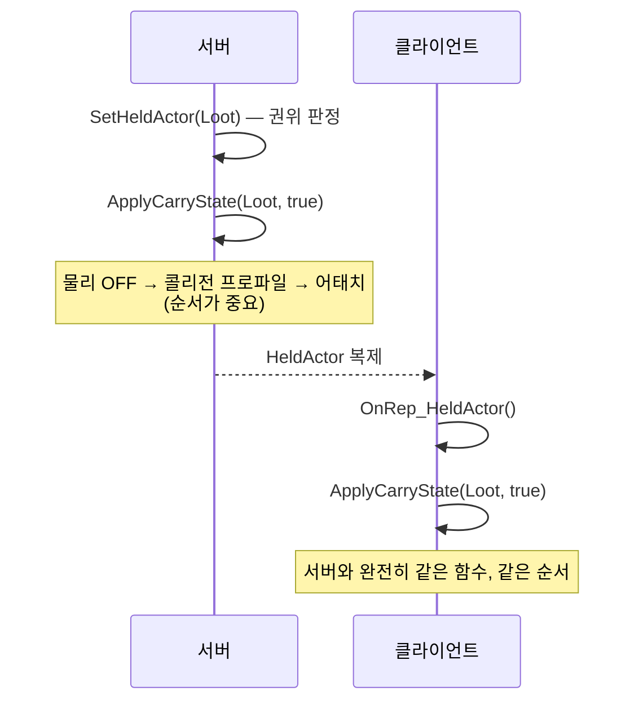

# 02. 네트워크 & 리플리케이션 전략

> 이 문서는 **커밋되어 확인 가능한 코드**를 기준으로 쓴다.
> 여기서 정한 규칙은 모든 시스템에 적용된다. 어기면 "호스트에서만 멀쩡한" 코드가 나온다.

---

## 1. 이 문서의 범위

**여기서 정하는 것**

- 서버 권위 판정을 어떻게 하는가
- 복제 수단 5종 중 무엇을 언제 쓰는가
- 상태를 바꿀 때 서버와 클라이언트가 같은 결과에 도달하는 방법
- 대역폭을 어디서 아끼는가
- 물리 액터와 GAS 의 복제 정책

**여기서 정하지 않는 것**

| 주제 | 문서 |
|---|---|
| 방 생성 · 검색 · 참가, 로비 → 은신처 전환 | [systems/Session.md](systems/Session.md) |
| 노획물별 물리 튜닝 값 | [systems/Loot-Physics.md](systems/Loot-Physics.md) |
| 어빌리티별 동작 | [systems/Player-GAS.md](systems/Player-GAS.md) |
| 소음 전파 알고리즘 | [systems/Noise-Alert.md](systems/Noise-Alert.md) |

### 대전제

**이 게임은 Listen Server 다. 호스트는 서버이면서 동시에 플레이어다.**

여기서 오는 함정이 이 문서 전체를 관통한다 — **호스트에서 테스트하면 거의 모든 버그가 숨는다.**
호스트에서는 서버 코드와 클라이언트 코드가 같은 프로세스, 같은 메모리에서 돈다.
복제를 빠뜨려도, 권위 체크를 잘못해도, OnRep 을 안 만들어도 호스트 창은 멀쩡히 동작한다.

> **반드시 PIE 2인 이상(Net Mode: Play As Listen Server)으로 테스트할 것.**
> 클라이언트 창에서 확인하지 않은 기능은 동작한다고 말할 수 없다.

---

## 2. 네트워크 형태와 설정값

| 항목 | 값 | 위치 | 근거 |
|---|---|---|---|
| 형태 | Listen Server | — | 전용 서버를 둘 인프라가 없다 |
| 세션 | `OnlineSubsystemNull` (LAN + 직접 IP) | `Config/DefaultEngine.ini` `[OnlineSubsystem]` | Steam 은 추후 |
| 서버 틱레이트 | `NetServerMaxTickRate=60` (기본 30) | `Config/DefaultEngine.ini` `[IpNetDriver]` | **4인 물리 운반 동기화에서 서버 스냅샷 간격이 곧 보간 지연이 된다** |
| 클라이언트 대역폭 | 5.4 기본값 유지 (100000) | — | `ConfiguredInternetSpeed` / `MaxClientRate` 를 손대지 않는다 |

틱레이트를 올린 것은 물리 운반 때문이다. 물리 물체는 **서버 스냅샷 간격이 그대로
클라이언트가 보는 끊김**이 된다. 30Hz 에서는 4인이 동시에 물건을 옮길 때 눈에 띄게 튄다.

---

## 3. 서버 권위 원칙

**모든 게임플레이 판정은 서버에서만 한다.** 클라이언트는 입력을 보내고 결과를 받는다.

판정에 해당하는 것 — 소음 발행, 경계도 계산, 인지 게이지, 파손 판정, 노획물 가치,
운반 성립 여부, 어빌리티 활성화.

### 권위 판정 방법 — 대상별로 다르다

| 판정 주체 | 쓸 것 | 이유 |
|---|---|---|
| `UActorComponent` | `HasServerAuthority(this)` | `GetOwnerRole()` 단독으로는 뚫린다 (아래) |
| 서브시스템 · 콘솔 명령 등 소유 액터가 없는 쪽 | `HasServerAuthority(GetWorld())` | 롤을 물어볼 액터가 없다 |
| `AActor` | `AActor::HasAuthority()` | 표준. `NetAuthority.h` 에 액터 오버로드는 없다 |

`Shared/NetAuthority.h` 의 자유 함수 두 개가 앞 두 줄을 담당한다.

**왜 컴포넌트는 특별한가.** 예전에는 컴포넌트마다 `HasNoiseAuthority()` / `HasAlertAuthority()` 를
각자 들고 있었고, 서브시스템은 또 다른 기준(`NetMode`)을 썼다. 그 둘은 같은 뜻이 아니다 —
**클라이언트에서 로컬 스폰된 비복제 액터는 `GetOwnerRole()` 이 `ROLE_Authority` 라
컴포넌트 게이트를 그냥 통과한다.** 지금까지 사고가 안 난 것은 서브시스템 게이트가 뒤에서
한 번 더 막아줬기 때문이지 의도한 안전이 아니었다.

지금은 `HasServerAuthority(UActorComponent*)` 가 두 조건을 모두 본다 —
클라이언트 창이면 무조건 아니고, 그 외에는 소유자 롤을 따른다.

> **TODO:** 액터용 오버로드를 추가할지 검토. 지금은 `AActor::HasAuthority()` 를 쓰는 것이
> 맞지만, 세 갈래를 외워야 한다는 점이 실수 여지로 남는다. 코드 변경이므로 담당자 합의 필요.

### 클라이언트에서 호출해도 안전해야 한다

`UNoiseSubsystem` 은 클라이언트에서도 인스턴스가 생기지만 **발행 API 가 전부 조용히 무시된다.**

이건 게으름이 아니라 설계다. 소음 발행은 4명이 전부 호출하는 API 다.
호출부마다 `if (HasAuthority())` 를 쓰게 하면 누군가는 반드시 빠뜨린다.
**여러 사람이 호출하는 API 는 게이트를 호출부가 아니라 API 안에 둔다.**

같은 원칙이 `ALootBase::BeginPlay()` 에도 적용된다 — 충돌 델리게이트(`OnComponentHit`)를
서버에서만 바인딩한다. 클라이언트는 아예 판정 경로에 진입하지 못한다.

---

## 4. 복제 수단 선택 기준

| 수단 | 언제 쓰나 | 실제 사례 |
|---|---|---|
| `UPROPERTY(Replicated)` | 값만 필요하고 변화 시점에 할 일이 없을 때 | `APlayerSessionState::SelectedCharacterID`<br/>`UAlertComponent::NoisiestPlayer` |
| `UPROPERTY(ReplicatedUsing = OnRep_X)` | **값이 바뀔 때 클라이언트가 해야 할 일이 있을 때.** 기본으로 쓴다 | `ABaseCharacter::HeldActor`<br/>`ALootBase::PrimaryCarrier`<br/>`UAlertComponent::ReplicatedGauge` |
| `UFUNCTION(Server, Reliable)` | 클라이언트 입력을 서버에 올릴 때 | `ABaseCharacter::Server_ApplyGameplayEffect`<br/>`AShelterPlayerController::ServerSendChatMessage` |
| `UFUNCTION(Client, Reliable)` | 특정 클라이언트 1명에게만 보낼 때 | `AShelterPlayerController::ClientReceiveChatMessage` |
| `UFUNCTION(NetMulticast, Unreliable)` | **연출 전용.** 한 번 터지고 끝나는 이펙트 · SFX | 현재 0개 (아래) |

**RPC 함수명에는 `Server_` / `Client_` / `Multicast_` 접두사를 붙인다.**
호출부에서 네트워크를 타는 호출인지 한눈에 보여야 한다.
네이밍 규칙 전체는 [05-Conventions.md](05-Conventions.md) 3장에 있다.

### Server RPC 에는 `WithValidation` 을 붙인다

클라이언트가 보내는 값은 **전부 의심한다.** 검증 없이 받으면 한 명이 서버를 통해
전원에게 영향을 줄 수 있다 (예: 거대한 문자열 하나로 전원의 대역폭을 먹는 것).

```cpp
UFUNCTION(Server, Reliable, WithValidation)
void Server_SendChatMessage(const FString& Message);
```

**`_Validate` 에서 무엇을 막을지 주의할 것.** 검증 실패는 엔진이 **해당 클라이언트의 접속을 끊는**
동작이다. 그래서 "빈 문자열" 처럼 정상 범위의 잘못된 입력은 여기서 막지 않고
`_Implementation` 에서 조용히 무시한다. `_Validate` 는 **악의적인 입력만** 막는다.

### NetMulticast 는 연출 전용이다

현재 이 프로젝트에 `NetMulticast` RPC 는 **하나도 없다.** 상태 동기화가 전부 OnRep 으로 되어 있다.
이 상태를 규칙으로 굳힌다.

**상태는 언제나 복제 프로퍼티 + OnRep 으로 동기화한다. NetMulticast 로 상태를 바꾸지 않는다.**

이유 — Multicast RPC 는 **그 순간 접속해 있는 클라이언트에게만** 간다.
나중에 들어오거나 관련성(relevancy)이 늦게 생긴 클라이언트는 그 호출을 영영 못 받는다.
반면 복제 프로퍼티는 늦게 온 클라이언트에게도 현재 값이 전달된다.
체포 → 관전 → 복귀가 있는 게임이라 이 차이가 실제로 문제가 된다.

**NetMulticast 가 허용되는 것은 상태를 남기지 않는 연출뿐이다** —
파손 파편, 사운드, 카메라 셰이크. 놓쳐도 게임 상태가 어긋나지 않는 것들.
기획서 5장 파손 처리 흐름의 `[Multicast] 파괴 연출 · 사운드 재생 (연출 전용)` 이 정확히 이 경우다.

이때도 **`Unreliable` 로 둔다.** 연출을 `Reliable` 로 보내면 대역폭을 먹고,
패킷 순서 보장 때문에 중요한 상태 복제가 뒤로 밀린다.

> GAS 를 쓰는 시스템은 `NetMulticast` 대신 **GameplayCue** 를 우선한다.
> `Config/Tags/Cue.ini` 에 이미 16종이 정의되어 있다. GAS 밖 시스템만 `NetMulticast` 를 쓴다.

### DOREPLIFETIME 등록을 빠뜨리는 사고

`ALootBase::GetLifetimeReplicatedProps` 주석에 있는 그대로다 —

> 등록을 빠뜨려도 컴파일 에러가 나지 않고 호스트에서는 멀쩡히 동작한다. 반드시 확인할 것.

`ReplicatedUsing` 을 선언하고 `DOREPLIFETIME` 을 잊는 것이 이 프로젝트에서 가장 나기 쉬운 사고다.
**복제 프로퍼티를 추가할 때는 반드시 `GetLifetimeReplicatedProps` 를 같이 연다.**

---

## 5. OnRep 재실행 패턴

이 프로젝트의 시그니처 패턴이다. **반드시 지킬 것.**

### 문제

부착(`AttachToComponent`), 물리 토글(`SetSimulatePhysics`), 콜리전 프로파일 변경은
**복제되지 않는 로컬 호출**이다. 서버에서 이것들을 실행해도 클라이언트에서는 아무 일도 일어나지 않는다.

복제되는 것은 "누가 들고 있는가"(`HeldActor`, `PrimaryCarrier`)라는 **사실 하나뿐**이다.

### 해법

클라이언트가 그 사실을 받았을 때, **서버가 밟았던 순서를 똑같이 다시 밟는다.**



**핵심은 서버와 OnRep 이 같은 함수 하나만 부른다는 것이다.**
`ABaseCharacter::ApplyCarryState()` 와 `ALootBase::ApplyCarryState()` 가 각각 그 함수다.
양쪽 다 "모든 머신에서 실행된다"고 주석에 명시되어 있고, **이름도 일부러 같다** —
운반 상태를 만지는 함수를 찾을 때 한 이름으로 찾을 수 있게.

서버 경로와 클라이언트 경로에 각각 코드를 쓰면 **반드시 어긋난다.** 그리고 그 어긋남은
"클라이언트에서만 물건이 손에 안 붙는다" 같은 형태로 나타나는데, 로그에는 아무것도 안 남는다.

### 순서가 중요한 이유

`ABaseCharacter::ApplyCarryState` 주석에 근거가 있다 —
**런타임에는 물리 시뮬레이션 중인 컴포넌트를 웰드 없이 부착할 수 없다**
(엔진 `SceneComponent.cpp`, 이중 트랜스폼 갱신 방지). **반드시 물리를 먼저 끈다.**

### 서버 전용 데이터는 복제하지 않는다

권위 로직에서만 쓰는 값은 복제 목록에 넣지 않는다.

| 값 | 클래스 | 왜 |
|---|---|---|
| `NoiseContribution` (맵 전체) | `UAlertComponent` | 서버 집계용. 클라이언트는 1위만 필요 |
| `RecentlyThrownActor` / `RecentlyThrownTime` | `ABaseCharacter` | 재획득 금지 판정은 서버에서만 한다 |

---

## 6. 대역폭 최적화

### 게이지 양자화 — `Shared/Gauge01.h`

0~1 게이지를 `uint8` 로 접어서 복제한다. 해상도 약 0.4%p — HUD 바에는 충분하다.

**`float` 를 그대로 복제하면 자연 감소 중에 매 프레임 값이 바뀌어,
GameState 의 넷 업데이트 레이트(`AActor` 기본 100Hz)만큼 계속 전송된다.**
경계도 감소는 30~60초씩 이어지므로 그동안 내내 나간다.
`uint8` 로 끊으면 1%/초 기준 초당 2~3번만 dirty 가 되어 나머지는 아예 전송되지 않는다.

적용 대상 — `UAlertComponent::ReplicatedGauge`, `UPerceptionMeterComponent::ReplicatedPerception`.

> **양자화 식은 `Gauge01.h` 하나만 쓴다.** 예전에 두 컴포넌트와 테스트가 각자 복사본을 들고 있었고,
> 그래서 **테스트가 프로덕션 코드가 아니라 자기 복사본을 검증하고 있었다.**
> 서버·클라이언트·테스트가 조금이라도 다른 식을 쓰면 HUD 가 서버와 어긋나는데,
> 그 어긋남은 로그에도 컴파일 경고에도 잡히지 않는다.

**양자화된 값으로 판정하지 말 것.** 단계 판정은 항상 원본 `float`(`AlertGauge`)으로 한다.

### 파생 가능한 값도 복제해야 하는 경우

`UAlertComponent::AlertLevel` 은 게이지에서 유도할 수 있어 보이지만 **별도로 복제한다.**
히스테리시스가 있어서 같은 게이지 값이라도 이전 단계에 따라 결과가 다르기 때문이다.

**"클라이언트가 계산해서 알아낼 수 있다"와 "계산하면 같은 답이 나온다"는 다르다.**
상태 의존성이 있으면 복제한다.

### 컬렉션 대신 결과만 복제

`NoiseContribution` 맵 전체를 복제하려면 `FFastArraySerializer` 를 쓰거나 매치 종료 RPC 를
따로 만들어야 한다. 결과 화면이 필요한 것은 1위뿐이므로 `NoisiestPlayer` /
`NoisiestContribution` 두 개만 복제한다.

기여량은 단조 증가라 1위 갱신이 O(1) 이다 — 새 기여량이 기존 1위를 넘을 때만 바뀐다.
그래서 매 소음마다 맵 전체를 훑을 필요가 없고, dirty 도 순위가 실제로 뒤집힐 때만 생긴다.

### 업데이트 빈도

| 클래스 | 설정 | 이유 |
|---|---|---|
| `ALootBase` | `NetUpdateFrequency = 60` / `MinNetUpdateFrequency = 20` | 물리 물체. `NetServerMaxTickRate=60` 과 짝 |
| `APlayerSessionState` | `NetUpdateFrequency = 100` | — |
| `UAlertComponent` | `TickInterval = 0.1f` | 144fps 기준 틱 횟수가 14분의 1 |

---

## 7. 물리 리플리케이션

### 모드 — PredictiveInterpolation

```cpp
// ALootBase::BeginPlay()
SetPhysicsReplicationMode(EPhysicsReplicationMode::PredictiveInterpolation);
```

**클라이언트는 예측하지 않고 서버 스냅샷을 향해 속도 보간만 한다.**

이유 — 클라이언트마다 물리 결과가 미세하게 달라서, 예측을 켜면 사람마다 다른 결과가 나온다.
4인이 같은 물건을 보고 있는 게임에서 이건 치명적이다.

UE 5.4 에는 **전역 ini 키가 없다.** `AActor::SetPhysicsReplicationMode()` 로 액터마다 지정한다.
**새 물리 액터를 만들면 `BeginPlay` 에서 직접 호출해야 한다.**

> **TODO:** `PredictiveInterpolation` 은 엔진에서 `(WIP)` 로 표시된 기능이다.
> 문제가 생겼을 때 `Default` 로 되돌릴 폴백 스위치가 필요하다. 아직 없다.

### PhysicsPrediction 은 건드리지 않는다

`Config/DefaultEngine.ini` 의 `[/Script/Engine.PhysicsSettings]` 주석 그대로 —

> `bEnablePhysicsPrediction` 은 Resimulation 전용 히스토리 캐시이며,
> 엔진 주석상 resim 을 쓰지 않을 때도 물리 해석에 영향을 준다. `PredictiveInterpolation` 에는 불필요.

### 서브스테핑

```ini
bSubstepping=True
MaxSubstepDeltaTime=0.008333   ; 120Hz 상한
MaxSubsteps=6                  ; 30Hz 저사양 클라이언트에서도 4분할 확보
```

2인 협력 캐리(중량형)에서 캡슐-물체 구속이 진동하지 않게 하려는 것이다.

### 이동 복제

`ALootBase` 는 `bReplicates = true` + `SetReplicateMovement(true)` 를 함께 켠다.
물리 물체는 둘 다 필요하다 — 전자는 프로퍼티, 후자는 트랜스폼이다.

---

## 8. GAS 네트워크 정책

### ASC 는 PlayerState 에 둔다

`APlayerSessionState` 가 `UAbilitySystemComponent` 와 `UBaseAttributeSet` 을 소유한다.

**체포 → 관전 → 복귀 시 폰은 파괴되지만 스킬 강화 수치는 유지되어야 한다.**
Character 에 두면 부활할 때마다 날아간다.

대가로 **PlayerState 는 폰보다 늦게 도착할 수 있다.** ASC 접근 코드는 `nullptr` 을 견뎌야 하고,
초기화는 `PossessedBy`(서버)와 `OnRep_PlayerState`(클라이언트) 양쪽에서 이뤄져야 한다.

> **TODO:** 현재 `ABaseCharacter` 와 `APlayerSessionState` 가 둘 다 `IAbilitySystemInterface` 를
> 구현 중이다. `ABaseCharacter::GetAbilitySystemComponent()` 가 PlayerState 의 ASC 를
> 돌려주도록 정리해야 한다. [01-Architecture.md](01-Architecture.md) 5장 참조.

### AttributeSet 복제

```cpp
DOREPLIFETIME_CONDITION_NOTIFY(UBaseAttributeSet, Health,        COND_None, REPNOTIFY_Always);
DOREPLIFETIME_CONDITION_NOTIFY(UBaseAttributeSet, MovementSpeed, COND_None, REPNOTIFY_Always);
```

**`REPNOTIFY_Always` 를 쓴다.** 기본값(`REPNOTIFY_OnChanged`)은 값이 같으면 OnRep 을 건너뛰는데,
GAS 는 서버 값으로 되돌릴 때(예측이 틀렸을 때) 같은 값이 다시 오는 경우가 있다.
그때 알림이 안 오면 클라이언트가 잘못된 예측 결과를 그대로 들고 있게 된다.

**새 Attribute 를 추가할 때도 이 형태를 그대로 쓴다.**

### 클라이언트 → 서버 이벤트

어빌리티가 서버 ASC 에 이벤트를 보낼 때는
`UBaseGameplayAbility::SendGameplayEventToASCOnServer(EventTag, Payload)` 를 쓴다.
태그는 `Config/Tags/Event.ini` 에 정의된 것만 사용한다.

### 어빌리티 활성화

어빌리티는 로컬에서 활성화되고 서버가 확정한다(GAS 기본 예측 모델).
**단, 판정 결과는 서버 것을 따른다** — 예를 들어 `GAB_Interact` 가 무엇을 집을지는
클라이언트가 고르더라도, 실제로 집히는지는 서버의 `SetHeldActor()` 가 정한다.

---

## 9. 증상 역인덱스

네트워크 버그는 **로그에도 컴파일 경고에도 안 잡히는 것들**이라 증상부터 찾는 편이 빠르다.
새 사고를 겪으면 여기에 한 줄 추가할 것.

| 증상 | 의심할 것 | 절 |
|---|---|---|
| 호스트에서는 되는데 클라이언트에서만 안 된다 | 애초에 클라이언트 창에서 테스트하지 않았다 | 1 |
| 클라이언트에서만 물건이 손에 안 붙는다 | 서버와 OnRep 이 다른 코드를 밟고 있다 | 5 |
| 물건이 캐릭터 발밑에서 튕긴다 | 물리를 끄기 전에 부착했다 (순서 위반) | 5 |
| 값이 클라이언트에 아예 안 온다 | `DOREPLIFETIME` 등록을 빠뜨렸다 | 4 |
| 늦게 접속/복귀한 사람만 상태가 다르다 | 상태를 `NetMulticast` 로 바꿨다 | 4 |
| HUD 게이지가 서버와 미세하게 어긋난다 | 양자화 식을 복사해서 썼다 | 6 |
| 경계도 단계가 클라이언트에서만 틀리다 | 양자화된 값으로 단계를 판정했다 | 6 |
| 클라이언트에서 스폰한 액터가 권위 게이트를 통과한다 | 컴포넌트에서 `GetOwnerRole()` 을 직접 썼다 | 3 |
| 물리 물체가 사람마다 다른 곳에 있다 | 물리 복제 모드를 지정하지 않았다 | 7 |
| 물리 물체가 눈에 띄게 튄다 | `SetReplicateMovement` 를 안 켰거나 업데이트 빈도가 낮다 | 6, 7 |
| 예측이 틀린 뒤 어트리뷰트가 안 돌아온다 | `REPNOTIFY_Always` 를 안 썼다 | 8 |
| 폰은 있는데 ASC 가 `nullptr` 이다 | PlayerState 도착 전에 접근했다 | 8 |

---

## 10. 이 문서를 고쳐야 할 때

- 새 복제 수단(예: `FFastArraySerializer`, `Push Model`)을 도입하려면 **4장 표에 먼저 추가하고 근거를 적는다**
- 새 사고를 겪으면 **9장에 증상 한 줄을 추가한다.** 이게 이 문서에서 가장 자주 늘어야 할 부분이다
- 3장·5장 규칙을 어겨야 할 상황이 생기면, 어기지 말고 **규칙을 고치자고 제안할 것**
