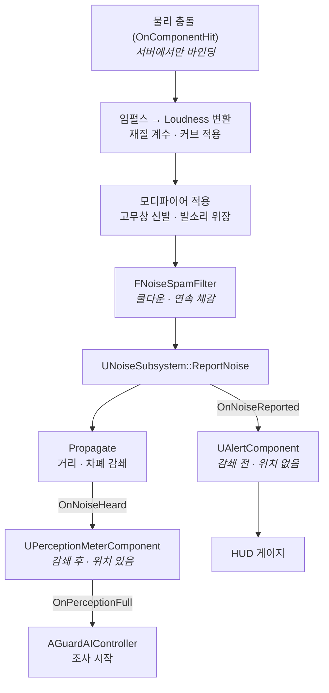

# 소음 · 경계도 · 인지 게이지

| | |
|---|---|
| **담당** | 지성인 |
| **코드 위치** | `develop` (병합 완료) |
| **소스** | `Source/HeavyHanded/Public|Private/Noise/`, `.../Alert/`, `.../Shared/` |
| **태그** | `Config/Tags/Noise.ini`, `Config/Tags/Alert.ini` |
| **설정** | Project Settings → Game → **Noise** / **Alert** |
| **테스트** | `L_NoiseTest` 맵, `HeavyHanded.Noise.*` · `HeavyHanded.Alert.*` |

---

## 1. 이 시스템이 하는 일

기획서 3장 — **모든 물리 충돌이 소음이 되고, 소음이 경비를 부른다.**

세 개의 서로 다른 것을 다룬다.

| | 무엇 | 범위 |
|---|---|---|
| **소음** | 어디서 얼마나 큰 소리가 났는가 | 이벤트 1건 |
| **경계도** | 저택 전체가 얼마나 곤두서 있는가 | 맵 전역, 위치 개념 없음 |
| **인지 게이지** | 경비 1명이 얼마나 알아챘는가 | 개체별, 위치에 따라 다름 |

**셋을 분리한 것이 이 시스템 설계의 전부다.** 벽 너머에서 금고를 뜯으면
경계도는 똑같이 오르지만 옆방 경비는 못 듣는다. 하나로 합치면 둘 중 하나가 틀린다.

---

## 2. 클래스 구성

| 클래스 | 역할 |
|---|---|
| `UNoiseSubsystem` | 발행 · 전파 · 감쇄. 월드 단일 서비스 |
| `UNoiseEmitterComponent` | 물리 충돌 → 소음 변환. 소리 내는 액터에 붙인다 |
| `FNoiseSpamFilter` | 충돌 스팸을 "태그당 쿨다운 주기 1건"으로 묶는 상태 머신 (순수 구조체) |
| `INoiseListener` | 소음을 듣는 쪽의 인터페이스 |
| `UPerceptionMeterComponent` | 경비 1명의 인지 게이지. `INoiseListener` 구현체 |
| `UAlertComponent` | 저택 전체 경계도. GameState 에 런타임 부착 |
| `UNoiseSettings` `UAlertSettings` | 튜닝 값 |
| `Shared/Gauge01.h` | 0~1 게이지 ↔ `uint8` 양자화 (경계도·인지 게이지 공용) |

테스트 전용 — `ANoiseTestProp` `ANoiseTestListener` `ANoiseTestBlocker`

---

## 3. 핵심 흐름 — 소음 1건의 여정

**경로가 둘로 갈리는 지점이 `ReportNoise` 다.**

- **감쇄 전** (`OnNoiseReported`) → 경계도. 청취 위치 개념이 없다
- **감쇄 후** (`INoiseListener::OnNoiseHeard`) → 경비. 거리와 차폐가 반영된다

### 서버 권위

발행 경로 전체가 서버 전용이다. `UNoiseEmitterComponent` 는 **클라이언트에서 히트 델리게이트를
아예 바인딩하지 않는다** — 클라마다 물리 결과가 미세하게 달라 신뢰할 수 없기 때문이다.

`UNoiseSubsystem` 은 클라에서도 인스턴스가 생기지만 **발행 API 가 전부 조용히 무시된다.**
4명이 호출하는 API 라 호출부에 권위 체크를 맡기지 않는다
([02-Networking.md](../02-Networking.md) 3장).

---

## 4. 스팸 필터 — 이 시스템의 핵심

### 문제

와인 랙 같은 불안정형이 구르면 `OnComponentHit` 이 **초당 수십 번** 온다.
그대로 더하면 한 번 굴린 것으로 경보 100% 가 된다.

### 해법 — 축을 두 개로 나눈다

| 축 | 필드 | 의미 | 억제하나 |
|---|---|---|---|
| 들리는 크기 | `FNoiseEvent::Loudness01` | 경비에게 얼마나 크게 들리는가 | **아니오** |
| 경계도 기여 | `FNoiseEvent::AlertScale` | 얼마나 새로운 정보인가 | **예** |

**규칙 1 — 발행은 제 크기 그대로 나간다.**
경비에게는 실제로 그만큼 크게 들려야 한다. 여기를 깎으면 **전파 반경(`FNoiseEvent::Radius`)까지
같이 쪼그라들어** 경비가 아예 못 듣게 된다.

**규칙 2 — 억제는 `AlertScale` 한쪽에서만 한다.**
직전 발행 대비 증가분만 반영하며, 더 커지지 않았으면 `0` 이다 —
**경비에겐 들리되 저택 경계도는 오르지 않는다.**

### 필터 내부에서 주의할 것

**`LastEmittedLoudness` 는 반드시 절대값이다.**
여기에 "차액"을 넣으면 다음 차액이 그 차액을 기준으로 계산돼 **발행량이 부풀어 오른다** —
`0.8` 발행 → `0.1` 발행 → 기준이 `0.1` 이 되어 다음에 `0.75` 가 나가는 식이다.

**`ConsecutiveHits` 는 접수 횟수가 아니라 발행 횟수다.**
쿨다운 주기당 1씩만 오른다. 접수마다 올리면 구르는 프롭이 한 프레임에도 수십 번 부딪히면서
1초도 안 되어 `ConsecutiveFloor` 에 박히고, `ConsecutiveFalloff` 가 튜닝 값 구실을 못한다.

**발행은 순회가 끝난 뒤에 한다.**
`TMap` 순회 중에 발행하면 청취자가 반응하다 새 소음을 내면서 순회 중이던 맵이 재할당된다.
그래서 `FNoisePendingEmitArray` 에 모았다가 내보낸다.

### 왜 순수 구조체인가

`FNoiseSpamFilter` 는 **`UObject` 도 `UWorld` 도 쓰지 않는다.**
월드 없이 (입력 시퀀스 → 발행 시퀀스) 로 검증하기 위해서다
(`Private/Tests/NoiseSpamFilterTest.cpp`, 테스트 4종).

> **이 규칙을 지키려면 액터 · 컴포넌트 · 서브시스템을 여기로 들여오지 말 것.**

---

## 5. 전파와 감쇄

`UNoiseSubsystem::Propagate` 가 반경 안 청취자에게 거리 · 차폐 감쇄를 적용해 전달한다.

| 요소 | 설정 |
|---|---|
| 거리 감쇄 지수 | `UNoiseSettings::DistanceFalloffExponent` |
| 차폐물 재질별 감쇄율 | `UNoiseSettings::OccluderFactor` |
| 세는 차폐물 최대 개수 | `UNoiseSettings::MaxOccluders` |
| 가청 하한 | `UNoiseSettings::MinAudibleStrength` |
| 전 구역 소음 | `FNoiseProfileRow::bGlobal` — 거리·차폐를 모두 무시 |

### 청취자 위치 계약

`INoiseListener::GetListenerLocation()` 의 반환 지점은 **소유 액터 위치에서 500cm
(`ListenerCullMargin`) 안**이어야 한다.

서브시스템이 액터 위치로 값싼 1차 거리 컬링을 한 **뒤에야** 이 함수를 부르기 때문이다
(`BlueprintNativeEvent` 라 호출 자체가 `ProcessEvent` 를 탄다).

**어기면 반경 경계의 청취자가 조용히 걸러진다.** 개발 빌드에서는 `ensure` 로 잡히지만
쉬핑에서는 아무 신호도 없다. `UPerceptionMeterComponent::EarHeight` 의 `ClampMax` 300 이
이 계약과 묶여 있다.

액터에서 멀리 떨어진 지점을 듣게 하려면 **별도 청취자를 그 자리에 두는 편이 맞다.**

### 지속형 소음

대형 금고 절단처럼 계속 나는 소음은 `StartContinuousNoise()` / `StopContinuousNoise()` 로
핸들을 잡고 관리한다. **반드시 Stop 할 것.**

지속형이 하나도 없으면 서브시스템은 아예 틱하지 않는다 (`IsTickable`).

---

## 6. 경계도 (`UAlertComponent`)

GameState 에 런타임 부착되며 **서버가 계산하고 전원에게 복제된다.**
부착은 `UNoiseSubsystem::HandleGameStateSet()` 이 한다.

### 히스테리시스

단계는 게이지만으로 결정되지 않는다. **진입은 `Enter`, 이탈은 `Exit` 를 쓰고 그 간격이
히스테리시스다.** 없으면 경계값 근처에서 단계가 깜빡이며 셔터가 열렸다 닫혔다 한다.

임계값은 `UAlertSettings` 에 있고, `PostEditChangeProperty` 가 뒤집힌 값 저장을 막는다.
`HeavyHanded.Alert.Thresholds.HysteresisNotInverted` 테스트가 이 관계를 지킨다.

> 히스테리시스 때문에 **단계는 게이지에서 유도할 수 없다.** 그래서 둘 다 복제한다.

### 경보는 래치된다

`Alarm`(100%) 은 회복 불가다. `ResetAlert()` 만이 푼다.
기획서 3장 — **경보는 실패가 아니라 90초 도주 페이즈의 시작이다.**

### 자연 감소

무소음 유예가 단계별로 다르다 — 평온·의심 30초, 경계 60초 (`UAlertSettings`).
경비가 더 오래 곤두서 있게 하려는 것이다.

### 최다 소음 유발자

기획서 8장의 결과 화면 항목. 서버는 `NoiseContribution` 맵으로 전원 기여도를 집계하지만
**클라이언트에는 1위만 복제한다** (`NoisiestPlayer` / `NoisiestContribution`).

기여량은 단조 증가라 1위 갱신이 O(1) 이다 — 새 기여량이 기존 1위를 넘을 때만 바뀐다.
맵 전체를 복제하려면 `FFastArraySerializer` 나 매치 종료 RPC 가 필요했다.

---

## 7. 인지 게이지 (`UPerceptionMeterComponent`)

경비 1명의 "소리를 들었다" 게이지. 기획서 3장 —
플레이어에게 **숨거나 멈출 유예**를 주는 장치다.

| 파라미터 | 의미 |
|---|---|
| `GainPerStimulus` | `Strength` 1.0 자극 1건이 올리는 양 |
| `DecayGraceSeconds` | 무자극 유예 |
| `DecayPerSecond` | 초당 감소량 |
| `EarHeight` | 귀 높이. 5장 계약과 묶여 있다 |

### 래치를 반드시 풀어야 한다

100% 에서 래치되고 `OnPerceptionFull` 이 한 번 발생한다.

> **`ResetPerception()` 을 조사 종료 후 반드시 호출할 것.
> 이게 없으면 경비가 영원히 100% 에 박혀 있다.**

현재 `AGuardAIController::HandlePerceptionFull()` 이 호출한다.

### 경계

**누적 계산은 이 시스템(지성인), 100% 이후의 조사 행동과 BT 는 AI 파트(유정석).**
`OnPerceptionFull` 이 그 경계선이다.

---

## 8. 데이터와 수치

| 무엇 | 어디 |
|---|---|
| 행동별 등급 · 경계도 · 반경 · 쿨다운 | `DT_NoiseProfiles` (`FNoiseProfileRow`) |
| 재질 계수 · 감쇄 · 디버그 | `UNoiseSettings` |
| 경계도 임계값 · 감소율 | `UAlertSettings` |
| 소음 종류 이름 | `Config/Tags/Noise.ini` |
| 경계 단계 · 상승 원인 | `Config/Tags/Alert.ini` |

**`DT_NoiseProfiles` 의 `RowName` 은 태그 이름과 같아야 한다.**
정확히 일치하는 행이 없으면 부모 태그로 거슬러 올라간다
([04-DataManagement.md](../04-DataManagement.md) 4장).

기획서 부록 밸런싱 시트가 그대로 이 테이블이다.

> `UNoiseEmitterComponent` 는 `ImpactTag` 프로파일을 `BeginPlay` 에 캐시한다.
> **게임 도중 `DT_NoiseProfiles` 를 다시 임포트해도 갱신되지 않는다.**
> 임펄스 밸런싱을 만졌으면 PIE 를 다시 시작할 것.

---

## 9. 네트워크

| 값 | 복제 | 비고 |
|---|---|---|
| `UAlertComponent::ReplicatedGauge` | `uint8` 양자화 | 원본 `AlertGauge` 는 복제하지 않는다 |
| `UAlertComponent::AlertLevel` | 그대로 | 히스테리시스 때문에 유도 불가 |
| `NoisiestPlayer` / `NoisiestContribution` | 그대로 | 1위만 |
| `NoiseContribution` (맵) | **안 함** | 서버 전용 |
| `UPerceptionMeterComponent::ReplicatedPerception` | `uint8` 양자화 | **경비 20명 × 클라 4명** 이면 그 자체로 무시할 양이 아니다 |

**양자화 식은 `Shared/Gauge01.h` 하나만 쓴다.** 단계 판정에는 절대 쓰지 않는다 —
판정은 항상 원본 `float` 으로 한다. 자세한 근거는 [02-Networking.md](../02-Networking.md) 6장.

---

## 10. 다른 시스템과의 접점

| 상대 | 방향 | 수단 |
|---|---|---|
| 물리 · 아이템 (김민준) | → 이쪽 | `FLootImpactEvent` (물리적 사실만). 해석은 이쪽이 한다 |
| 경비 AI (유정석) | 이쪽 → | `UPerceptionMeterComponent::OnPerceptionFull` |
| UI | 이쪽 → | `OnAlertGaugeChanged` / `OnAlertLevelChanged` / `OnPerceptionChanged` |
| 장비 · 패시브 (전영배) | → 이쪽 | `FNoiseModifier` 등록/해제 (`AddModifier` / `RemoveModifier`) |
| 환경 방해 요소 (오유석) | 양방향 | `ReportTaggedNoise` 발행, `INoiseListener` 구현 |

### 새 소음원을 붙이려면

1. `Config/Tags/Noise.ini` 에 태그 추가 (담당자에게 알릴 것)
2. `DT_NoiseProfiles` 에 같은 이름의 행 추가
3. 액터에 `UNoiseEmitterComponent` 부착 (물리 충돌) 또는 `ReportTaggedNoise()` 호출 (그 외)

### 새 청취자를 붙이려면

`INoiseListener` 를 구현하고 `BeginPlay` / `EndPlay` 에서 직접 등록 · 해제한다.
`GetListenerLocation()` 의 500cm 계약(5장)을 지킬 것.

**소음 코드를 상속하거나 수정할 필요는 없다.** 그러라고 인터페이스와 `FNoiseModifier` 를
값 구조체로 둔 것이다.

---

## 11. 알려진 제약과 TODO

- **`FOnLootImpactSignature` · `FOnNoiseReported` 는 BP 에 열지 않는다.**
  BP 에서 소음 판정 로직을 짜는 것을 원천 차단하기 위해서다
  ([03-CppVsBlueprint.md](../03-CppVsBlueprint.md) 5장)
- `UNoiseEmitterComponent` 의 프로파일 캐시는 런타임에 갱신되지 않는다 (8장)
- 없는 프로파일은 **태그당 한 번만** 경고한다. 물리 충돌 경로라 매번 찍으면 로그가 잠긴다

> **TODO:** `UAlertComponent::EvaluateLevel` 이 private 이라 `AlertLevelTest` 가 규칙을
> 복제해 들고 있다. `FAlertLevelRules` 같은 자유 함수로 빼서 테스트가 프로덕션 코드를 직접
> 검증하게 할 것 ([07-Testing.md](../07-Testing.md) 3장).

> **TODO:** `Config/DefaultAlertSystem.ini` 가 아직 없다. `UAlertSettings` 가 C++ 기본값만
> 쓰는 상태다. Project Settings 에서 한 번 저장해 생성한 뒤 **반드시 커밋할 것.**

> **TODO:** 경비 시야 · 감지 장치로 인한 경계도 상승(`Alert.Source.Vision`,
> `Alert.Source.Device`)은 태그만 정의되어 있고 발행하는 코드가 없다.
> AI · Hazard 파트가 붙을 때 연결한다.
